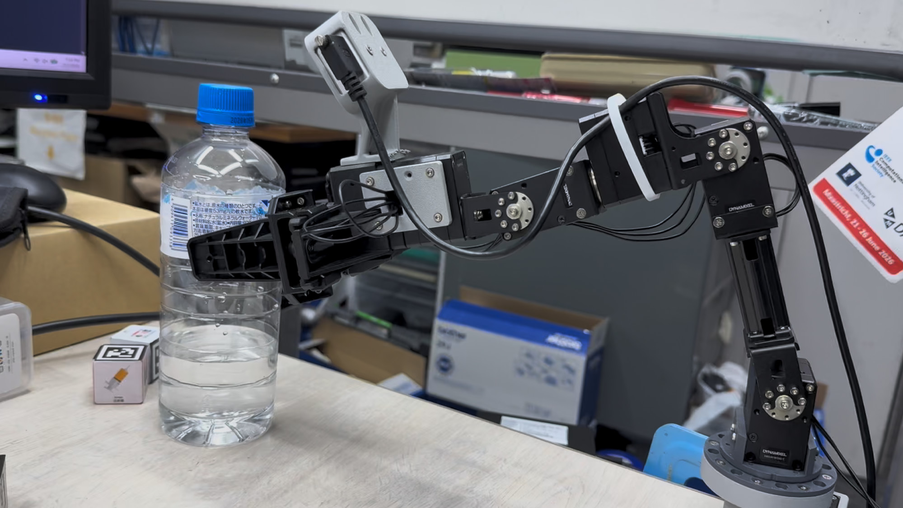
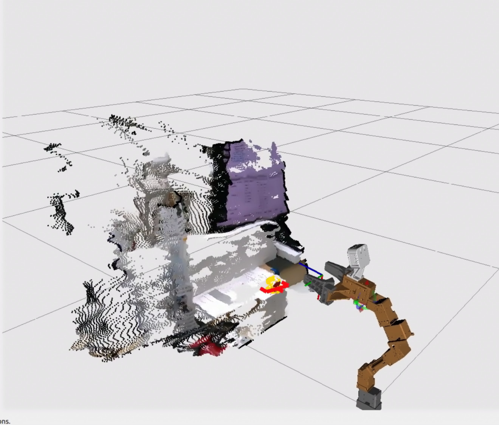

# OM6DOF



ROS 2 Humble stack for a six-axis Dynamixel manipulator: hardware, control,
MoveIt, RealSense perception, pick-and-place, and DD-GNG mapping.

Runs on a Jetson AGX. A Jetson NX optionally adds Unitree Go2W services; the
AGX works fine without it.



The arm and what its camera sees share one world frame, so a detection can be
reached for directly.

## Clone

The Dynamixel packages are upstream repositories, so clone recursively:

```bash
git clone --recursive https://github.com/tzf230201/om6dof.git
```

Already cloned without `--recursive`?

```bash
git submodule update --init --recursive
```

## Install

```bash
sudo apt install \
  ros-humble-ros2-control ros-humble-ros2-controllers \
  ros-humble-moveit ros-humble-librealsense2 \
  ros-humble-controller-manager-msgs freeglut3-dev

# librealsense2 ships the C library but not the Python binding
python3 -m pip install --user pyrealsense2==2.58.2.10647
```

## Build

```bash
cd ~/ros2_ws
source /opt/ros/humble/setup.bash
unset CYCLONEDDS_URI          # a stale override breaks DDS on the standalone AGX

colcon build --symlink-install
source install/setup.bash
```

## Run

```bash
ros2 launch om6dof_teleop full_stack.launch.py start_go2w_teleop:=false
```

Then open the dashboard at `http://<agx-ip>:8080`.

The arm starts in `AUTONOMOUS` (MoveIt owns it). Switch to `JOINT` to take
streamed control. See [om6dof_controller](om6dof_controller/README.md) for the
full mode list.

## Packages

| Package | What it does |
|---|---|
| [om6dof_description](om6dof_description/README.md) | URDF, meshes, kinematics |
| [om6dof_bringup](om6dof_bringup/README.md) | U2D2 hardware owner, ros2_control setup |
| [om6dof_controller](om6dof_controller/README.md) | Operation modes, IK, limits, watchdogs |
| [om6dof_controllers](om6dof_controllers/README.md) | C++ controller plugins |
| [om6dof_teleop](om6dof_teleop/README.md) | Joystick and Go2W remote adapter |
| [om6dof_moveit_config](om6dof_moveit_config/README.md) | MoveIt configuration |
| [om6dof_perception](om6dof_perception/README.md) | RealSense RGB-D and YOLOX detection |
| [om6dof_pick_and_place](om6dof_pick_and_place/README.md) | Pickup via MoveIt and perception |
| [om6dof_pick_and_place_gemini](om6dof_pick_and_place_gemini/README.md) | Grasping from a point cloud, reasoning by Gemini |
| [om6dof_dd_gng](om6dof_dd_gng/README.md) | DD-GNG semantic mapping |
| [om6dof_phosphobot_bridge](om6dof_phosphobot_bridge/README.md) | Phosphobot bridge |

Vendored from ROBOTIS:

| Package | Source |
|---|---|
| DynamixelSDK | submodule of [ROBOTIS-GIT/DynamixelSDK](https://github.com/ROBOTIS-GIT/DynamixelSDK) (`humble`) |
| dynamixel_interfaces | submodule of [ROBOTIS-GIT/dynamixel_interfaces](https://github.com/ROBOTIS-GIT/dynamixel_interfaces) (`humble`) |
| [dynamixel_hardware_interface](dynamixel_hardware_interface/README.md) | **fork** of [ROBOTIS-GIT/dynamixel_hardware_interface](https://github.com/ROBOTIS-GIT/dynamixel_hardware_interface) — kept in-tree, see below |

`dynamixel_hardware_interface` is not a submodule because it carries local work
upstream does not have: bus-health monitoring, per-read timeouts, selectable
read transport, a sequential read path, and the `dxl_read_diagnostic` tool.

## Research

- [Leader-arm gravity compensation](docs/leader_arm_gravity_compensation.md) —
  Mode 0 current control, gravity model, experiments, limits
- [Documentation index](docs/README.md)

## Safety

- Clear the workspace before every startup or restart.
- **Never run two U2D2 owners.** `om6dof_bringup` and `om6dof_leader_controller`
  are mutually exclusive.
- **Never run perception and DD-GNG together.** They share one RealSense.
- Return to `AUTONOMOUS` before running MoveIt trajectories.
- In the leader profile, ROS `effort` is current in **mA**, not torque in N·m.
  Never write raw KDL torque to it.
- Port 8080 has no authentication. Trusted LAN or VPN only.
