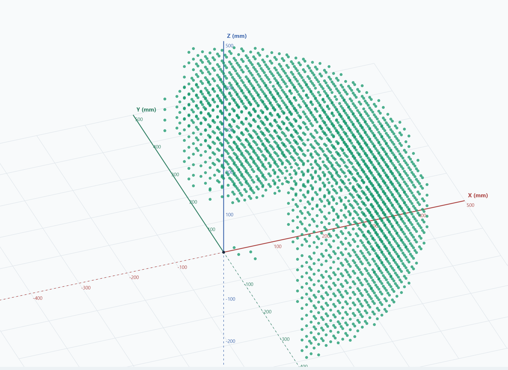
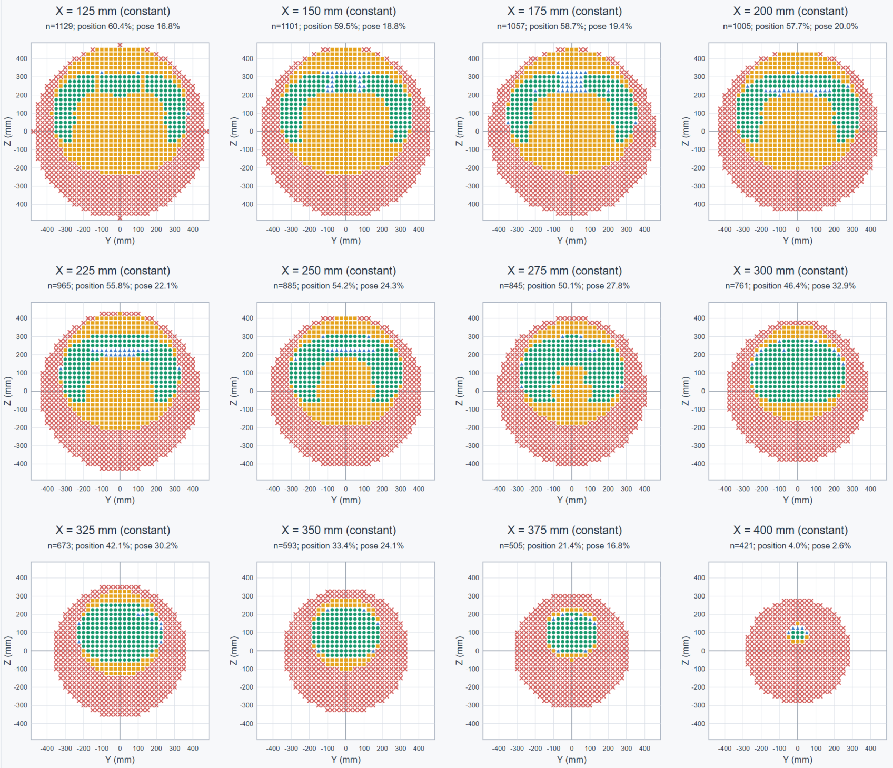

# OM6DOF


ROS 2 Humble stack for a six-axis Dynamixel manipulator: hardware, control,
MoveIt, RealSense perception, pick-and-place, and DD-GNG mapping.

Runs on a Jetson AGX. A Jetson NX optionally adds Unitree Go2W services; the
AGX works fine without it.


The arm and what its camera sees share one world frame, so a detection can be
reached for directly.

## Mechanical design reference

The mechanical design and robot-description assets are adapted from the ROBOTIS
[OpenManipulator Friends](https://github.com/ROBOTIS-GIT/open_manipulator_friends)
six-DOF arm. For a ROS 2-oriented reference, see
[open_manipulator_friends_ros2](https://github.com/tzf230201/open_manipulator_friends_ros2).

This project adds a wrist-mounted RealSense camera and uses updated dynamics
parameters. The upstream OpenManipulator Friends repository is licensed under
[Apache License 2.0](https://github.com/ROBOTIS-GIT/open_manipulator_friends/blob/main/LICENSE).
Upstream authors, reused files, and modifications are documented in
[NOTICE](NOTICE) and the [robot-description notice](om6dof_description/NOTICE).

## License and attribution

The wrist-camera bracket comes from [ALOHA](https://github.com/tonyzhaozh/aloha)
and retains its MIT license, Copyright (c) 2023 Tony Z. Zhao. The standalone
bracket mesh is unchanged apart from its filename; its full license is included
in [LICENSE-ALOHA.txt](om6dof_description/meshes/LICENSE-ALOHA.txt).

Original OM6DOF contributions are licensed under [Apache License 2.0](LICENSE),
except where a file or component states different terms. Third-party files
retain their original copyright and license terms. The robot-description
package installs its own copies of `LICENSE` and `NOTICE` alongside its assets.

See [licensing and provenance](docs/LICENSING.md) for the verified upstream
inventory, redistribution requirements, and unresolved sources of additional
camera/bracket meshes and legacy DD-GNG components.

## Interactive workspace demo

[Open the 3D workspace explorer](https://tzf230201.github.io/om6dof/viewer3d.html)
or [browse the 2D slices, analysis, and data](https://tzf230201.github.io/om6dof/).
No installation, ROS, or robot connection is required; just open the link in a
browser. Rotate, pan, and zoom the view, filter result categories, select
constant-X/Y/Z planes, and inspect a sample's coordinates and saved joint solution.

The current snapshot contains **31,799 sampled points on a 25 mm grid**, up
from 3,911 points at 50 mm. There are **117 coordinate slices**: 39 per axis,
from -475 to +475 mm in 25 mm increments. Both the 3D viewer and 2D maps use
the same markers:

| Marker | Result |
|---|---|
| Green circle | Pose found |
| Blue triangle | Pose found · near singular |
| Yellow square | Position found · orientation unresolved |
| Purple diamond | Only colliding candidates found |
| Red X | Position unresolved |

This is a saved, model-based experiment computed in C++, not the live robot
dashboard or an interactive IK solver. Browser controls only display and filter
the recorded data; they do not send robot commands or recompute reachability.
The scan tests one orientation per point. Unresolved samples are not proof of
mechanical dead zones, and successful samples do not guarantee a safe path
between them.



3D preview filtered to green "Pose found" samples; coordinates are in millimetres.



Twelve selected Y–Z slices at constant X = 125–400 mm, in 25 mm steps.

## Clone

The Dynamixel packages are upstream repositories, so clone recursively:

```bash
git clone --recursive https://github.com/tzf230201/om6dof.git
```

Already cloned without `--recursive`?

```bash
git submodule update --init --recursive
```

## Install

```bash
sudo apt install \
  ros-humble-ros2-control ros-humble-ros2-controllers \
  ros-humble-moveit ros-humble-librealsense2 \
  ros-humble-controller-manager-msgs freeglut3-dev

# librealsense2 ships the C library but not the Python binding
python3 -m pip install --user pyrealsense2==2.58.2.10647
```

## Build

```bash
cd ~/ros2_ws
source /opt/ros/humble/setup.bash
unset CYCLONEDDS_URI          # a stale override breaks DDS on the standalone AGX

colcon build --symlink-install
source install/setup.bash
```

## Run

```bash
ros2 launch om6dof_teleop full_stack.launch.py start_go2w_teleop:=false
```

Then open the dashboard at `http://<agx-ip>:8080`.

The arm starts in `AUTONOMOUS` (MoveIt owns it). Switch to `JOINT` to take
streamed control. See [om6dof_controller](om6dof_controller/README.md) for the
full mode list.

## Packages

| Package | What it does |
|---|---|
| [om6dof_description](om6dof_description/README.md) | URDF, meshes, kinematics |
| [om6dof_bringup](om6dof_bringup/README.md) | U2D2 hardware owner, ros2_control setup |
| [om6dof_controller](om6dof_controller/README.md) | Operation modes, IK, limits, watchdogs |
| [om6dof_controllers](om6dof_controllers/README.md) | C++ controller plugins |
| [om6dof_teleop](om6dof_teleop/README.md) | Joystick and Go2W remote adapter |
| [om6dof_moveit_config](om6dof_moveit_config/README.md) | MoveIt configuration |
| [om6dof_perception](om6dof_perception/README.md) | RealSense RGB-D and YOLOX detection |
| [om6dof_pick_and_place](om6dof_pick_and_place/README.md) | Pickup via MoveIt and perception |
| [om6dof_pick_and_place_gemini](om6dof_pick_and_place_gemini/README.md) | Grasping from a point cloud, reasoning by Gemini |
| [om6dof_dd_gng](om6dof_dd_gng/README.md) | DD-GNG semantic mapping |
| [om6dof_phosphobot_bridge](om6dof_phosphobot_bridge/README.md) | Phosphobot bridge |

Vendored from ROBOTIS:

| Package | Source |
|---|---|
| DynamixelSDK | submodule of [ROBOTIS-GIT/DynamixelSDK](https://github.com/ROBOTIS-GIT/DynamixelSDK) (`humble`) |
| dynamixel_interfaces | submodule of [ROBOTIS-GIT/dynamixel_interfaces](https://github.com/ROBOTIS-GIT/dynamixel_interfaces) (`humble`) |
| [dynamixel_hardware_interface](dynamixel_hardware_interface/README.md) | **fork** of [ROBOTIS-GIT/dynamixel_hardware_interface](https://github.com/ROBOTIS-GIT/dynamixel_hardware_interface) — kept in-tree, see below |

`dynamixel_hardware_interface` is not a submodule because it carries local work
upstream does not have: bus-health monitoring, per-read timeouts, selectable
read transport, a sequential read path, and the `dxl_read_diagnostic` tool.

## Research

- [Leader-arm gravity compensation](docs/leader_arm_gravity_compensation.md) —
  Mode 0 current control, gravity model, experiments, limits
- [Documentation index](docs/README.md)

## Safety

- Clear the workspace before every startup or restart.
- **Never run two U2D2 owners.** `om6dof_bringup` and `om6dof_leader_controller`
  are mutually exclusive.
- **Never run perception and DD-GNG together.** They share one RealSense.
- Return to `AUTONOMOUS` before running MoveIt trajectories.
- In the leader profile, ROS `effort` is current in **mA**, not torque in N·m.
  Never write raw KDL torque to it.
- Port 8080 has no authentication. Trusted LAN or VPN only.
