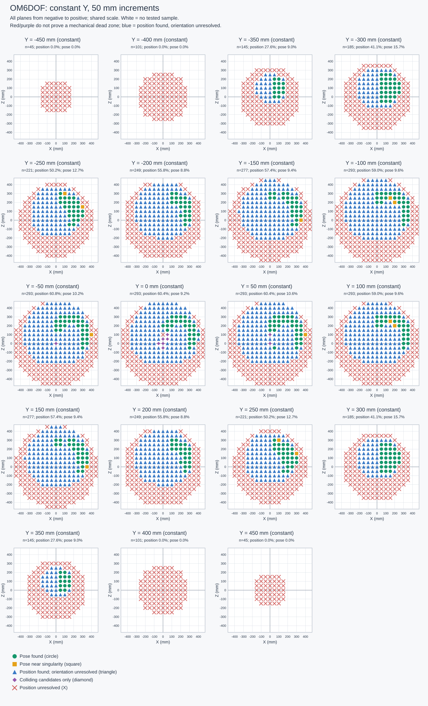
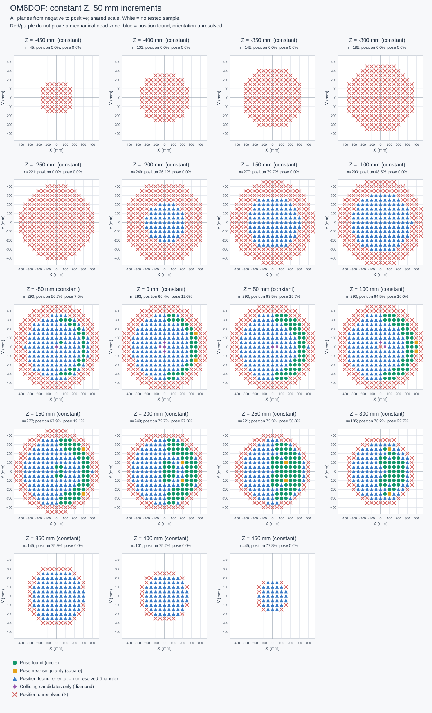

# OM6DOF Cartesian workspace analysis

This offline experiment contains **31799 discrete points**. The report shows every constant-X, constant-Y, and constant-Z plane at multiples of **25 mm**, from negative to positive coordinates within the sample range. On each plane, the other two coordinates vary; the report is not limited to the X=Y=Z=0 slices.

Solver parameters, target orientation, tolerances, model radius, seeds, and computation time are recorded in [summary.json](summary.json). Joint values and the orientation actually tested at each point are in [points.csv](points.csv). Open the [interactive 3D viewer](viewer3d.html), [all constant-coordinate planes](index.html), or [per-plane statistics](slices.csv).

## Main results

- Position found without requiring a specific orientation: **15532/31799 (48.8%)**.
- Both position and the tested orientation found: **2935/31799 (9.2%)**.
- Among the poses found, 197 points are classified as near singularity. This describes the best candidate found; it does not prove that every configuration at that point is singular.
- 909 selected position candidates have less than 1 degree of margin to an effective joint limit. This indicates sensitivity of those candidates, not that every solution lies near a limit.

| Category | Points | Percentage of all points |
|---|---:|---:|
| Pose found | 2738 | 8.61% |
| Pose near singularity | 197 | 0.62% |
| Position found; orientation unresolved | 12597 | 39.61% |
| Colliding candidates only | 90 | 0.28% |
| Position unresolved | 16177 | 50.87% |

These percentages count only tested grid points; they do not measure continuous workspace volume or the physical robot's probability of success.

## Interpretation for mechanical design

1. **Green** provides a witness joint configuration satisfying the position, tested orientation, joint limits, and model self-collision check.
2. **Blue triangles** mean a pose was found, but the best candidate's Jacobian is poorly conditioned. Small Cartesian motions may require large joint changes. The rcond metric depends on length normalization; compare only experiments with identical settings.
3. **Yellow squares** separate orientation constraints from position reachability. They help evaluate gripper direction, wrist range, and tasks allowing a free orientation. They do not prove the requested orientation is impossible.
4. **Purple** means the search found only colliding position candidates under the approximate collision model; it does not prove that no collision-free configuration exists.
5. **Red** means the position search did not succeed. Possible causes include geometry, joint limits, too few seeds, or convergence to a local minimum. Do not treat it as proof of a mechanical dead zone.

Investigate suspected problem regions with a finer local grid, more seeds/iterations, several orientations, and mesh collision checks. Comparing zero joint margin with the operational margin can separate software constraints from the URDF range, but does not change or establish the physical hardware limits.

## Selected-candidate statistics

Margins are measured against the effective joint limits used by the scanner. Position-only results use the candidate with the smallest position error; full-pose results use the candidate with the best rcond.

| Metric | Samples | Minimum | Median | Maximum |
|---|---:|---:|---:|---:|
| Pose rcond (dimensionless) | 2935 | 0.00002 | 0.05778 | 0.12601 |
| Position-candidate joint margin (deg) | 15532 | 0.00000 | 14.36692 | 70.85408 |
| Position error of found poses (mm) | 2935 | 0.00005 | 0.00034 | 0.96794 |
| Orientation error of found poses (deg) | 2935 | 0.00000 | 0.00005 | 0.29005 |

Example candidates with the smallest joint margins (all joint values are available in points.csv):

| X (mm) | Y (mm) | Z (mm) | Margin (deg) | Status |
|---:|---:|---:|---:|---|
| -350 | -125 | 50 | 0.0000 | Position found; orientation unresolved |
| -350 | -125 | 75 | 0.0000 | Position found; orientation unresolved |
| -350 | 100 | 50 | 0.0000 | Position found; orientation unresolved |
| -350 | 125 | 50 | 0.0000 | Position found; orientation unresolved |
| -350 | 125 | 75 | 0.0000 | Position found; orientation unresolved |
| -325 | -150 | 125 | 0.0000 | Position found; orientation unresolved |
| -325 | -150 | 225 | 0.0000 | Position found; orientation unresolved |
| -325 | -25 | -100 | 0.0000 | Position found; orientation unresolved |

## All constant-coordinate planes

Each point appears once in each axis group when the grid aligns with the slice increment. Do not add the X+Y+Z group counts and interpret them as unique points. Planes with no samples are marked n/a, not counted as failures.

### Constant X


| X (mm) | Tested | Position found | Pose found | Near singularity | Orientation unresolved | Colliding only | Position unresolved |
|---:|---:|---:|---:|---:|---:|---:|---:|
| [-475](slices/X_minus_475mm.svg) | 81 | 0 (0.0%) | 0 (0.0%) | 0 | 0 | 0 | 81 |
| [-450](slices/X_minus_450mm.svg) | 193 | 0 (0.0%) | 0 (0.0%) | 0 | 0 | 0 | 193 |
| [-425](slices/X_minus_425mm.svg) | 301 | 0 (0.0%) | 0 (0.0%) | 0 | 0 | 0 | 301 |
| [-400](slices/X_minus_400mm.svg) | 421 | 0 (0.0%) | 0 (0.0%) | 0 | 0 | 0 | 421 |
| [-375](slices/X_minus_375mm.svg) | 505 | 21 (4.2%) | 0 (0.0%) | 0 | 21 | 0 | 484 |
| [-350](slices/X_minus_350mm.svg) | 593 | 114 (19.2%) | 0 (0.0%) | 0 | 114 | 0 | 479 |
| [-325](slices/X_minus_325mm.svg) | 673 | 202 (30.0%) | 0 (0.0%) | 0 | 202 | 0 | 471 |
| [-300](slices/X_minus_300mm.svg) | 761 | 283 (37.2%) | 0 (0.0%) | 0 | 283 | 0 | 478 |
| [-275](slices/X_minus_275mm.svg) | 845 | 353 (41.8%) | 0 (0.0%) | 0 | 353 | 0 | 492 |
| [-250](slices/X_minus_250mm.svg) | 885 | 423 (47.8%) | 0 (0.0%) | 0 | 423 | 0 | 462 |
| [-225](slices/X_minus_225mm.svg) | 965 | 482 (49.9%) | 0 (0.0%) | 0 | 482 | 0 | 483 |
| [-200](slices/X_minus_200mm.svg) | 1005 | 540 (53.7%) | 0 (0.0%) | 0 | 540 | 0 | 465 |
| [-175](slices/X_minus_175mm.svg) | 1057 | 579 (54.8%) | 0 (0.0%) | 0 | 579 | 0 | 478 |
| [-150](slices/X_minus_150mm.svg) | 1101 | 617 (56.0%) | 0 (0.0%) | 0 | 617 | 0 | 484 |
| [-125](slices/X_minus_125mm.svg) | 1129 | 647 (57.3%) | 0 (0.0%) | 0 | 647 | 0 | 482 |
| [-100](slices/X_minus_100mm.svg) | 1177 | 675 (57.3%) | 0 (0.0%) | 0 | 675 | 0 | 502 |
| [-75](slices/X_minus_75mm.svg) | 1201 | 698 (58.1%) | 10 (0.8%) | 2 | 688 | 3 | 500 |
| [-50](slices/X_minus_50mm.svg) | 1201 | 705 (58.7%) | 10 (0.8%) | 2 | 695 | 6 | 490 |
| [-25](slices/X_minus_25mm.svg) | 1201 | 695 (57.9%) | 18 (1.5%) | 2 | 677 | 22 | 484 |
| [0](slices/X_plus_0mm.svg) | 1209 | 701 (58.0%) | 66 (5.5%) | 2 | 635 | 26 | 482 |
| [25](slices/X_plus_25mm.svg) | 1201 | 711 (59.2%) | 69 (5.7%) | 2 | 642 | 20 | 470 |
| [50](slices/X_plus_50mm.svg) | 1201 | 715 (59.5%) | 204 (17.0%) | 10 | 511 | 13 | 473 |
| [75](slices/X_plus_75mm.svg) | 1201 | 725 (60.4%) | 201 (16.7%) | 13 | 524 | 0 | 476 |
| [100](slices/X_plus_100mm.svg) | 1177 | 709 (60.2%) | 199 (16.9%) | 8 | 510 | 0 | 468 |
| [125](slices/X_plus_125mm.svg) | 1129 | 682 (60.4%) | 190 (16.8%) | 3 | 492 | 0 | 447 |
| [150](slices/X_plus_150mm.svg) | 1101 | 655 (59.5%) | 207 (18.8%) | 22 | 448 | 0 | 446 |
| [175](slices/X_plus_175mm.svg) | 1057 | 620 (58.7%) | 205 (19.4%) | 33 | 415 | 0 | 437 |
| [200](slices/X_plus_200mm.svg) | 1005 | 580 (57.7%) | 201 (20.0%) | 20 | 379 | 0 | 425 |
| [225](slices/X_plus_225mm.svg) | 965 | 538 (55.8%) | 213 (22.1%) | 22 | 325 | 0 | 427 |
| [250](slices/X_plus_250mm.svg) | 885 | 480 (54.2%) | 215 (24.3%) | 14 | 265 | 0 | 405 |
| [275](slices/X_plus_275mm.svg) | 845 | 423 (50.1%) | 235 (27.8%) | 7 | 188 | 0 | 422 |
| [300](slices/X_plus_300mm.svg) | 761 | 353 (46.4%) | 250 (32.9%) | 9 | 103 | 0 | 408 |
| [325](slices/X_plus_325mm.svg) | 673 | 283 (42.1%) | 203 (30.2%) | 8 | 80 | 0 | 390 |
| [350](slices/X_plus_350mm.svg) | 593 | 198 (33.4%) | 143 (24.1%) | 5 | 55 | 0 | 395 |
| [375](slices/X_plus_375mm.svg) | 505 | 108 (21.4%) | 85 (16.8%) | 8 | 23 | 0 | 397 |
| [400](slices/X_plus_400mm.svg) | 421 | 17 (4.0%) | 11 (2.6%) | 5 | 6 | 0 | 404 |
| [425](slices/X_plus_425mm.svg) | 301 | 0 (0.0%) | 0 (0.0%) | 0 | 0 | 0 | 301 |
| [450](slices/X_plus_450mm.svg) | 193 | 0 (0.0%) | 0 (0.0%) | 0 | 0 | 0 | 193 |
| [475](slices/X_plus_475mm.svg) | 81 | 0 (0.0%) | 0 (0.0%) | 0 | 0 | 0 | 81 |

### Constant Y



| Y (mm) | Tested | Position found | Pose found | Near singularity | Orientation unresolved | Colliding only | Position unresolved |
|---:|---:|---:|---:|---:|---:|---:|---:|
| [-475](slices/Y_minus_475mm.svg) | 81 | 0 (0.0%) | 0 (0.0%) | 0 | 0 | 0 | 81 |
| [-450](slices/Y_minus_450mm.svg) | 193 | 0 (0.0%) | 0 (0.0%) | 0 | 0 | 0 | 193 |
| [-425](slices/Y_minus_425mm.svg) | 301 | 0 (0.0%) | 0 (0.0%) | 0 | 0 | 0 | 301 |
| [-400](slices/Y_minus_400mm.svg) | 421 | 0 (0.0%) | 0 (0.0%) | 0 | 0 | 0 | 421 |
| [-375](slices/Y_minus_375mm.svg) | 505 | 65 (12.9%) | 18 (3.6%) | 5 | 47 | 0 | 440 |
| [-350](slices/Y_minus_350mm.svg) | 593 | 157 (26.5%) | 49 (8.3%) | 5 | 108 | 0 | 436 |
| [-325](slices/Y_minus_325mm.svg) | 673 | 241 (35.8%) | 77 (11.4%) | 4 | 164 | 0 | 432 |
| [-300](slices/Y_minus_300mm.svg) | 761 | 315 (41.4%) | 101 (13.3%) | 1 | 214 | 0 | 446 |
| [-275](slices/Y_minus_275mm.svg) | 845 | 388 (45.9%) | 113 (13.4%) | 4 | 275 | 0 | 457 |
| [-250](slices/Y_minus_250mm.svg) | 885 | 452 (51.1%) | 105 (11.9%) | 2 | 347 | 0 | 433 |
| [-225](slices/Y_minus_225mm.svg) | 965 | 507 (52.5%) | 103 (10.7%) | 3 | 404 | 0 | 458 |
| [-200](slices/Y_minus_200mm.svg) | 1005 | 556 (55.3%) | 92 (9.2%) | 2 | 464 | 0 | 449 |
| [-175](slices/Y_minus_175mm.svg) | 1057 | 601 (56.9%) | 86 (8.1%) | 1 | 515 | 0 | 456 |
| [-150](slices/Y_minus_150mm.svg) | 1101 | 633 (57.5%) | 101 (9.2%) | 7 | 532 | 0 | 468 |
| [-125](slices/Y_minus_125mm.svg) | 1129 | 675 (59.8%) | 115 (10.2%) | 8 | 560 | 0 | 454 |
| [-100](slices/Y_minus_100mm.svg) | 1177 | 690 (58.6%) | 110 (9.3%) | 11 | 580 | 0 | 487 |
| [-75](slices/Y_minus_75mm.svg) | 1201 | 709 (59.0%) | 111 (9.2%) | 13 | 598 | 0 | 492 |
| [-50](slices/Y_minus_50mm.svg) | 1201 | 719 (59.9%) | 113 (9.4%) | 13 | 606 | 3 | 479 |
| [-25](slices/Y_minus_25mm.svg) | 1201 | 707 (58.9%) | 115 (9.6%) | 11 | 592 | 25 | 469 |
| [0](slices/Y_plus_0mm.svg) | 1209 | 704 (58.2%) | 112 (9.3%) | 13 | 592 | 29 | 476 |
| [25](slices/Y_plus_25mm.svg) | 1201 | 706 (58.8%) | 116 (9.7%) | 11 | 590 | 27 | 468 |
| [50](slices/Y_plus_50mm.svg) | 1201 | 716 (59.6%) | 115 (9.6%) | 13 | 601 | 6 | 479 |
| [75](slices/Y_plus_75mm.svg) | 1201 | 711 (59.2%) | 112 (9.3%) | 12 | 599 | 0 | 490 |
| [100](slices/Y_plus_100mm.svg) | 1177 | 691 (58.7%) | 110 (9.3%) | 12 | 581 | 0 | 486 |
| [125](slices/Y_plus_125mm.svg) | 1129 | 674 (59.7%) | 115 (10.2%) | 12 | 559 | 0 | 455 |
| [150](slices/Y_plus_150mm.svg) | 1101 | 633 (57.5%) | 101 (9.2%) | 8 | 532 | 0 | 468 |
| [175](slices/Y_plus_175mm.svg) | 1057 | 601 (56.9%) | 86 (8.1%) | 3 | 515 | 0 | 456 |
| [200](slices/Y_plus_200mm.svg) | 1005 | 556 (55.3%) | 92 (9.2%) | 2 | 464 | 0 | 449 |
| [225](slices/Y_plus_225mm.svg) | 965 | 507 (52.5%) | 103 (10.7%) | 4 | 404 | 0 | 458 |
| [250](slices/Y_plus_250mm.svg) | 885 | 452 (51.1%) | 105 (11.9%) | 2 | 347 | 0 | 433 |
| [275](slices/Y_plus_275mm.svg) | 845 | 388 (45.9%) | 113 (13.4%) | 2 | 275 | 0 | 457 |
| [300](slices/Y_plus_300mm.svg) | 761 | 315 (41.4%) | 101 (13.3%) | 1 | 214 | 0 | 446 |
| [325](slices/Y_plus_325mm.svg) | 673 | 241 (35.8%) | 77 (11.4%) | 3 | 164 | 0 | 432 |
| [350](slices/Y_plus_350mm.svg) | 593 | 157 (26.5%) | 49 (8.3%) | 3 | 108 | 0 | 436 |
| [375](slices/Y_plus_375mm.svg) | 505 | 65 (12.9%) | 19 (3.8%) | 6 | 46 | 0 | 440 |
| [400](slices/Y_plus_400mm.svg) | 421 | 0 (0.0%) | 0 (0.0%) | 0 | 0 | 0 | 421 |
| [425](slices/Y_plus_425mm.svg) | 301 | 0 (0.0%) | 0 (0.0%) | 0 | 0 | 0 | 301 |
| [450](slices/Y_plus_450mm.svg) | 193 | 0 (0.0%) | 0 (0.0%) | 0 | 0 | 0 | 193 |
| [475](slices/Y_plus_475mm.svg) | 81 | 0 (0.0%) | 0 (0.0%) | 0 | 0 | 0 | 81 |

### Constant Z



| Z (mm) | Tested | Position found | Pose found | Near singularity | Orientation unresolved | Colliding only | Position unresolved |
|---:|---:|---:|---:|---:|---:|---:|---:|
| [-475](slices/Z_minus_475mm.svg) | 81 | 0 (0.0%) | 0 (0.0%) | 0 | 0 | 0 | 81 |
| [-450](slices/Z_minus_450mm.svg) | 193 | 0 (0.0%) | 0 (0.0%) | 0 | 0 | 0 | 193 |
| [-425](slices/Z_minus_425mm.svg) | 301 | 0 (0.0%) | 0 (0.0%) | 0 | 0 | 0 | 301 |
| [-400](slices/Z_minus_400mm.svg) | 421 | 0 (0.0%) | 0 (0.0%) | 0 | 0 | 0 | 421 |
| [-375](slices/Z_minus_375mm.svg) | 505 | 0 (0.0%) | 0 (0.0%) | 0 | 0 | 0 | 505 |
| [-350](slices/Z_minus_350mm.svg) | 593 | 0 (0.0%) | 0 (0.0%) | 0 | 0 | 0 | 593 |
| [-325](slices/Z_minus_325mm.svg) | 673 | 0 (0.0%) | 0 (0.0%) | 0 | 0 | 0 | 673 |
| [-300](slices/Z_minus_300mm.svg) | 761 | 0 (0.0%) | 0 (0.0%) | 0 | 0 | 0 | 761 |
| [-275](slices/Z_minus_275mm.svg) | 845 | 0 (0.0%) | 0 (0.0%) | 0 | 0 | 0 | 845 |
| [-250](slices/Z_minus_250mm.svg) | 885 | 0 (0.0%) | 0 (0.0%) | 0 | 0 | 0 | 885 |
| [-225](slices/Z_minus_225mm.svg) | 965 | 74 (7.7%) | 0 (0.0%) | 0 | 74 | 0 | 891 |
| [-200](slices/Z_minus_200mm.svg) | 1005 | 269 (26.8%) | 0 (0.0%) | 0 | 269 | 0 | 736 |
| [-175](slices/Z_minus_175mm.svg) | 1057 | 368 (34.8%) | 0 (0.0%) | 0 | 368 | 0 | 689 |
| [-150](slices/Z_minus_150mm.svg) | 1101 | 454 (41.2%) | 0 (0.0%) | 0 | 454 | 0 | 647 |
| [-125](slices/Z_minus_125mm.svg) | 1129 | 520 (46.1%) | 0 (0.0%) | 0 | 520 | 0 | 609 |
| [-100](slices/Z_minus_100mm.svg) | 1177 | 580 (49.3%) | 0 (0.0%) | 0 | 580 | 0 | 597 |
| [-75](slices/Z_minus_75mm.svg) | 1201 | 628 (52.3%) | 0 (0.0%) | 0 | 628 | 0 | 573 |
| [-50](slices/Z_minus_50mm.svg) | 1201 | 665 (55.4%) | 82 (6.8%) | 0 | 583 | 1 | 535 |
| [-25](slices/Z_minus_25mm.svg) | 1201 | 689 (57.4%) | 109 (9.1%) | 2 | 580 | 9 | 503 |
| [0](slices/Z_plus_0mm.svg) | 1209 | 710 (58.7%) | 136 (11.2%) | 4 | 574 | 12 | 487 |
| [25](slices/Z_plus_25mm.svg) | 1201 | 730 (60.8%) | 152 (12.7%) | 4 | 578 | 18 | 453 |
| [50](slices/Z_plus_50mm.svg) | 1201 | 749 (62.4%) | 184 (15.3%) | 4 | 565 | 15 | 437 |
| [75](slices/Z_plus_75mm.svg) | 1201 | 753 (62.7%) | 189 (15.7%) | 0 | 564 | 16 | 432 |
| [100](slices/Z_plus_100mm.svg) | 1177 | 763 (64.8%) | 186 (15.8%) | 3 | 577 | 11 | 403 |
| [125](slices/Z_plus_125mm.svg) | 1129 | 758 (67.1%) | 189 (16.7%) | 7 | 569 | 8 | 363 |
| [150](slices/Z_plus_150mm.svg) | 1101 | 760 (69.0%) | 208 (18.9%) | 12 | 552 | 0 | 341 |
| [175](slices/Z_plus_175mm.svg) | 1057 | 742 (70.2%) | 219 (20.7%) | 9 | 523 | 0 | 315 |
| [200](slices/Z_plus_200mm.svg) | 1005 | 718 (71.4%) | 261 (26.0%) | 18 | 457 | 0 | 287 |
| [225](slices/Z_plus_225mm.svg) | 965 | 692 (71.7%) | 306 (31.7%) | 60 | 386 | 0 | 273 |
| [250](slices/Z_plus_250mm.svg) | 885 | 650 (73.4%) | 275 (31.1%) | 13 | 375 | 0 | 235 |
| [275](slices/Z_plus_275mm.svg) | 845 | 612 (72.4%) | 231 (27.3%) | 11 | 381 | 0 | 233 |
| [300](slices/Z_plus_300mm.svg) | 761 | 562 (73.9%) | 171 (22.5%) | 13 | 391 | 0 | 199 |
| [325](slices/Z_plus_325mm.svg) | 673 | 510 (75.8%) | 37 (5.5%) | 37 | 473 | 0 | 163 |
| [350](slices/Z_plus_350mm.svg) | 593 | 452 (76.2%) | 0 (0.0%) | 0 | 452 | 0 | 141 |
| [375](slices/Z_plus_375mm.svg) | 505 | 386 (76.4%) | 0 (0.0%) | 0 | 386 | 0 | 119 |
| [400](slices/Z_plus_400mm.svg) | 421 | 308 (73.2%) | 0 (0.0%) | 0 | 308 | 0 | 113 |
| [425](slices/Z_plus_425mm.svg) | 301 | 232 (77.1%) | 0 (0.0%) | 0 | 232 | 0 | 69 |
| [450](slices/Z_plus_450mm.svg) | 193 | 142 (73.6%) | 0 (0.0%) | 0 | 142 | 0 | 51 |
| [475](slices/Z_plus_475mm.svg) | 81 | 56 (69.1%) | 0 (0.0%) | 0 | 56 | 0 | 25 |

## Limitations

- No ROS commands, servo connections, or robot motion. All results describe model kinematics, not measured physical accuracy.
- Each point tests one orientation defined by the experiment settings, not every rotation in SO(3). In radial mode, yaw follows the point's azimuth.
- The bounding sphere is a conservative model sampling domain, not a guarantee that every position inside its radius is reachable. Regions below the base are also sampled if inside the sphere; a table/floor is not modeled.
- Collision checks use approximate model links at the endpoint, not precise mechanical meshes, environmental obstacles, or a verified path from a starting configuration.
- Payload, flexibility, backlash, calibration, motor torque, gravity, velocity, and acceleration are not evaluated.
- Colored markers mark sample centers; they do not fill or classify the area/volume between samples. Unsampled positions are not assessed. Green circles, yellow squares, blue triangles, purple diamonds, and red X markers distinguish the categories.
- A confirmed mechanical dead zone requires additional evidence; numerical IK failure alone is insufficient.

## Experiment parameters (summary.json snapshot)

Check `orientation`, `rpy_deg`, reference frame, position/orientation tolerances, and joint margin before comparing maps. The reporter does not change scanner parameters or data.

```json
{
"engine":"C++17 Eigen/KDL, bounded multi-start LM",
"points":31799,
"radius_mm":491.30865204668481,
"conservative_urdf_bound_mm":491.30865204668481,
"elapsed_seconds":30.533269376,
"position_found":15532,
"pose_found":2935,
"arguments":{"spacing_mm":25,"samples":2000,"seeds":4,"iterations":100,"seed":42,"orientation":"radial","base_link":"world","tip_link":"end_effector_link","joint_margin_rad":0.02,"collision_radius_mm":25,"position_tolerance_mm":1,"orientation_tolerance_deg":0.5,"length_scale_mm":300,"singular_threshold":0.01,"rpy_deg":[0,0,0]},
"hard_lower_rad":[-1.5707963267948966,-2.0420352248333655,-1.5707963267948966,-1.2566370614359172,-1.5707963267948966,-1.5707963267948966],
"hard_upper_rad":[1.5707963267948966,2.1048670779051615,2.1362830044410597,1.2566370614359172,2.1048670779051615,1.5707963267948966],
"effective_lower_rad":[-1.5507963267948965,-2.0220352248333655,-1.5507963267948965,-1.2366370614359172,-1.5507963267948965,-1.5507963267948965],
"effective_upper_rad":[1.5507963267948965,2.0848670779051615,2.1162830044410597,1.2366370614359172,2.0848670779051615,1.5507963267948965],
"counts":{"collision_candidates_only":90,"orientation_unresolved":12597,"pose_found":2738,"pose_near_singular":197,"position_unresolved":16177},
"limitations":["Finite grid and seeds; unresolved is not proven unreachable","One orientation per point; not exhaustive SO(3)","Endpoint capsule collision only, no trajectory/obstacles/dynamics","Full sphere includes negative Z; no table","Singularity refers to best tested pose witness, not all configurations"]}

```
