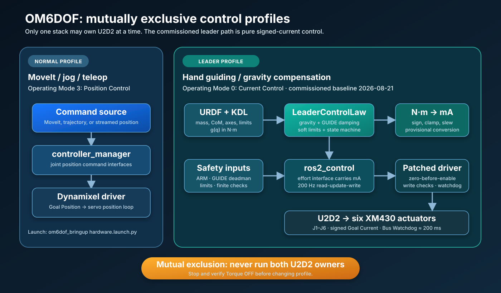
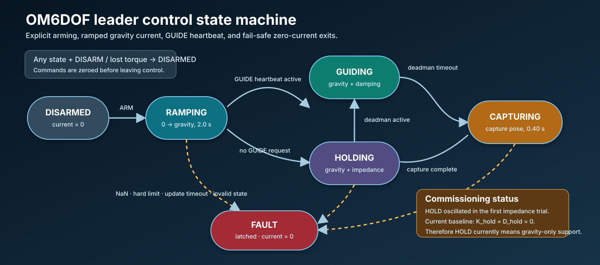
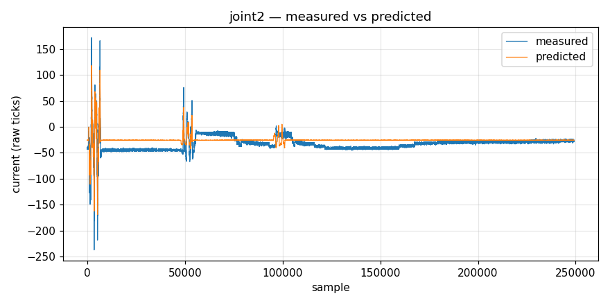
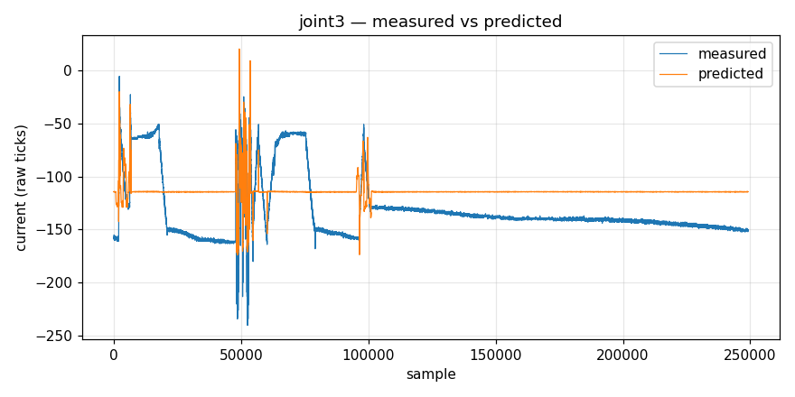
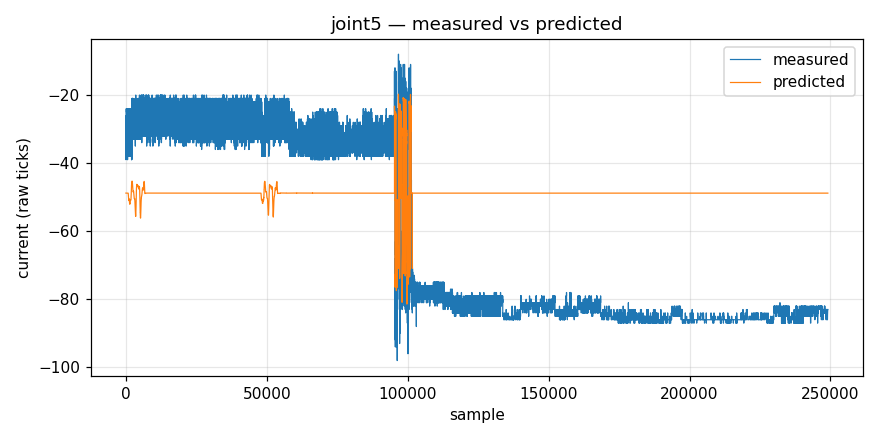
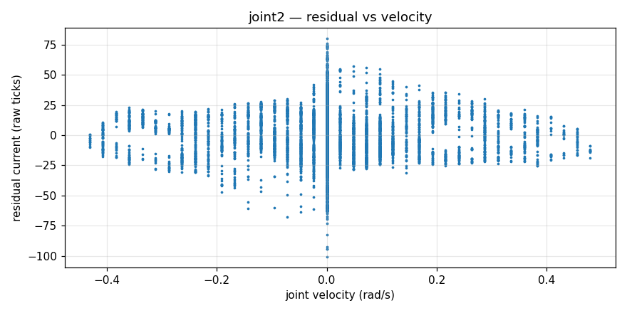
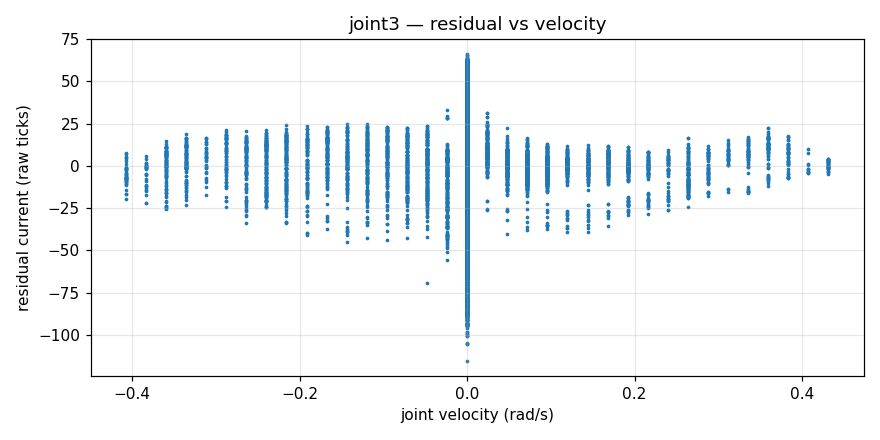
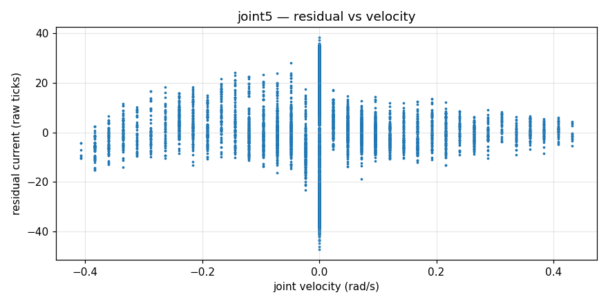

# Safe gravity-compensated hand guiding for OM6DOF

> Research and commissioning record — 2026-08-21<br>
> Status: GUIDE is usable with provisional calibration; quantitative validation,
> friction compensation, and stable HOLD are still open work.



## Ringkasan Bahasa Indonesia

Robot OM6DOF sekarang dapat dijalankan sebagai leader arm menggunakan enam
Dynamixel dalam **Operating Mode 0 (Current Control)**. KDL menghitung torsi
gravitasi dari URDF, controller mengubah torsi tersebut menjadi arus signed,
kemudian mengirimkannya secara bertahap melalui `ros2_control`. Pada pengujian
bertahap 10%, 25%, 50%, 75%, dan 100%, tidak terjadi sentakan pada aktivasi dan
arm terasa semakin ringan; pada skala 1.0 arm dinilai hampir seimbang.

Hasil ini masih commissioning, bukan validasi ilmiah final. Konversi mA/N·m
masih berasal dari rasio stall datasheet, belum dari kalibrasi beban. GUIDE belum
memakai model Coulomb/stiction/Stribeck. Percobaan HOLD dengan impedance nonzero
menimbulkan osilasi, sehingga gain HOLD sekarang dikembalikan ke nol. Semua
klaim dan angka di bawah dipisahkan menjadi hasil terukur, observasi operator,
dan hipotesis agar dapat dipakai dengan aman sebagai bahan paper.

## Abstract

This document reports the design and staged commissioning of gravity-compensated
hand guiding on a six-degree-of-freedom OM6DOF manipulator driven by XM430
actuators and ROS 2 Humble. An earlier Current-based Position Control approach
retained a servo position loop and produced a stiff response that moved toward a
position on activation. The commissioned architecture instead uses Dynamixel
Current Control, a URDF-derived Orocos KDL gravity model, explicit torque-to-current
conversion, current saturation and slew limiting, a GUIDE heartbeat, and layered
driver interlocks. Signed low-current pulses established joint direction, while
gravity support was introduced in measured steps. Activation snap was eliminated
and the perceived arm weight decreased monotonically, becoming nearly balanced
at nominal gravity scale. The present evidence is qualitative and single-robot;
torque calibration, interaction-force measurement, friction identification, and
stable pose holding remain future work.

## Research questions

1. Can the existing URDF and KDL gravity model provide useful hand guiding on
   the physical OM6DOF arm?
2. Does pure signed-current control remove the activation snap and rigidity
   observed with Current-based Position Control?
3. Can current direction be commissioned safely without a force/torque sensor?
4. How does perceived gravity support change across staged gravity gains?
5. What additional modeling is needed for transparent GUIDE and stable HOLD?

## Scope and terminology

The repository contains two distinct hardware profiles, and they must not be
confused:

| Profile | Primary use | Dynamixel mode | Arm command | U2D2 owner |
|---|---|---:|---|---|
| Normal OM6DOF | MoveIt, trajectories, jog, teleoperation | 3, Position Control | joint position | `om6dof_bringup` |
| Legacy compliant leader | historical experiment | 5, Current-based Position Control | position plus current ceiling | `om6dof_bringup current_control:=true` |
| Commissioned leader | gravity support and hand guiding | 0, Current Control | signed current | `om6dof_leader_controller` |

Only one process may own U2D2. The normal stack and leader stack are
**mutually exclusive**. A controller switch cannot change the actuator operating
mode safely by itself; change profiles only with the arm supported, current
zeroed, torque verified OFF, and the previous hardware owner stopped.

In the commissioned leader profile, the ROS interface is named `effort`, but
its numerical unit is **mA**, not N·m. The leader controller computes torque in
N·m and explicitly converts it before writing to the interface.

## Why the control architecture changed

The legacy `om6dof_controllers/LeaderArmController` runs against Dynamixel
Operating Mode 5. In that mode the actuator retains a position loop and the
current command acts as a current limit. During physical testing the arm became
hard to move and moved toward a position when the controller was activated.
Stopping the short-lived `ros2 control switch_controllers` CLI process with
Ctrl+C could not stop the active controller because the CLI had already sent a
request and exited; the controller continued inside `controller_manager`.

The new companion package, `om6dof_leader_controller`, uses Operating Mode 0.
Current is signed, zero is neutral, and no actuator position setpoint is active.
The controller starts unarmed, ramps current over two seconds, and uses a
heartbeat for GUIDE. This removed the observed startup snap.

ROBOTIS documents Current Control as controlling current independently of
position, while Current-based Position Control controls both position and
current. The manual also states that changing Operating Mode resets Goal Current
to Current Limit. Consequently, zero Goal Current must be written and verified
after a mode change and before torque is enabled.

## Hardware configuration

### Actuator map

| Joint | DXL ID | Reported model | Mode | Provisional conversion | Software current cap | Slew cap |
|---|---:|---|---:|---:|---:|---:|
| J1 | 31 | XM430-W350 | 0 | +560.98 mA/N·m | 250 mA | 200 mA/s |
| J2 | 32 | XM430-W350 | 0 | +560.98 mA/N·m | 800 mA | 400 mA/s |
| J3 | 33 | XM430-W350 | 0 | +560.98 mA/N·m | 700 mA | 400 mA/s |
| J4 | 24 | XM430-W210 | 0 | +766.67 mA/N·m | 300 mA | 200 mA/s |
| J5 | 35 | XM430-W350 | 0 | +560.98 mA/N·m | 350 mA | 200 mA/s |
| J6 | 26 | XM430-W210 | 0 | +766.67 mA/N·m | 200 mA | 150 mA/s |

The model-to-joint mapping should be checked against physical motor labels
before publication.

The provisional values use the official 12 V stall points:

$$
c_{W350}=\frac{2300\ \mathrm{mA}}{4.1\ \mathrm{N\,m}}
=560.98\ \mathrm{mA/N\,m}
$$

$$
c_{W210}=\frac{2300\ \mathrm{mA}}{3.0\ \mathrm{N\,m}}
=766.67\ \mathrm{mA/N\,m}
$$

These are not calibrated continuous torque constants. Gear efficiency,
temperature, supply voltage, gearbox friction, and assembly vary with operating
point. Near-balance at scale 1.0 may partly reflect compensating model errors.

The XM430 current register resolution is approximately 2.69 mA/tick. The
configured EEPROM limits therefore quantize approximately as follows:

| Joint | Raw ticks | Approximate limit |
|---|---:|---:|
| J1 | 93 | 250.17 mA |
| J2 | 297 | 798.93 mA |
| J3 | 260 | 699.40 mA |
| J4 | 112 | 301.28 mA |
| J5 | 130 | 349.70 mA |
| J6 | 74 | 199.06 mA |

### Communication

- Host: Jetson AGX, ROS 2 Humble.
- Bus: U2D2 at 1 Mbps.
- Control loop: configured at 200 Hz.
- FTDI latency: reduced from the Ubuntu default 16 ms to 1 ms using the ROBOTIS
  udev rule. In short validation windows, observed read failures fell from about
  12 per minute to zero. This is evidence for the observed setup, not a general
  reliability guarantee.
- Bus Watchdog: configured to 10 × 20 ms, approximately 200 ms, subject to
  supported firmware. It is a last layer, not an emergency stop.

## Robot model

The controller receives the URDF, parses it with `kdl_parser`, extracts the KDL
chain from `world` to `end_effector_link`, and validates that the movable-joint
order is exactly `joint1` through `joint6`. KDL `ChainDynParam` computes the
gravity vector using base-frame gravity `[0, 0, -9.80665]` m/s².

The model contains measured or CAD-derived mass, centre-of-mass, and inertia
values for the main links. Earlier work exposed an important tree-model issue:
the KDL serial chain omits massive branches such as both gripper fingers and the
D405 payload. The legacy controller compensated by folding approximately
0.114 kg of rigid off-chain mass into the nearest serial-chain link. Several
link centres of mass were also corrected. Parameters identified before those
changes are therefore stale and must not be transferred blindly.

The companion controller validates positive inertia and joint order, but that
does not prove physical model accuracy. A publishable model still needs mass,
CoM, inertia, payload, axis, and frame provenance.

## Control formulation

Let $q_i$ be position, $\dot q_i$ measured velocity, $\hat{\dot q}_i$ filtered
velocity, and $g_i(q)$ the KDL gravity torque.

### Velocity filter

$$
\alpha_v=\frac{\Delta t}{T_v+\Delta t},\qquad
\hat{\dot q}_{i,k}=\hat{\dot q}_{i,k-1}
+\alpha_v(\dot q_{i,k}-\hat{\dot q}_{i,k-1})
$$

The current configuration uses $T_v=0.025$ s.

### GUIDE

$$
\tau_i^*=s_g g_i(q)+\tau_{soft,i}(q_i,\hat{\dot q}_i)
-D_{guide,i}\hat{\dot q}_i
$$

The active GUIDE damping is:

```text
[0.08, 0.12, 0.10, 0.04, 0.05, 0.03] N·m·s/rad
```

The soft-limit term acts only inside the configured margin and opposes further
motion toward a hard limit.

### CAPTURE and HOLD

When the GUIDE heartbeat stops, the measured pose is copied into $q_h$ and the
controller enters CAPTURING. The nominal HOLD equation is:

$$
\tau_i^*=s_g g_i(q)+\tau_{soft,i}
+\alpha_c K_{hold,i}(q_{h,i}-q_i)
-D_{hold,i}\hat{\dot q}_i
$$

$\alpha_c$ rises from zero to one over 0.40 s. The first nonzero impedance trial
oscillated during HOLD, so the current safe baseline is:

```yaml
hold_stiffness: [0, 0, 0, 0, 0, 0]
hold_damping:   [0, 0, 0, 0, 0, 0]
```

The state machine still enters CAPTURING and HOLDING, but those states currently
provide gravity support and soft limits only. It is incorrect to claim that the
current baseline holds a fixed pose.



### Ramp, conversion, saturation, and slew

On ARM, gravity current is introduced over $T_r=2.0$ s:

$$
r(t)=\operatorname{clip}(t/T_r,0,1)
$$

$$
I_i^*=c_i\,r(t)\tau_i^*+r(t)b_i
$$

where $c_i$ is signed mA/N·m and $b_i$ is `current_bias`. Each current command is
clamped to $\pm I_{max}$ and its per-cycle change is limited by the configured
slew rate. The active bias is zero for all joints.

## Friction-model status

No identified friction feed-forward is active in the Mode 0 leader controller.
The GUIDE law contains gravity, soft-limit torque, and viscous GUIDE damping.
It does **not** contain Coulomb friction, static friction, Stribeck friction, or
direction-dependent breakaway compensation. `current_bias` is zero and a
constant bias would not be an adequate replacement for direction-dependent
friction.

The operator reported that J2 may push very slightly in GUIDE. Interpretation
depends on when it occurs:

- while stationary: gravity magnitude, current conversion, URDF mass/CoM, or
  a zero-current offset is more likely than viscous damping;
- only during motion: guide damping, mechanical friction, velocity filtering,
  or delay is more likely;
- near a limit: the soft-limit torque may be acting intentionally.

This effect should be reproduced with logging before changing a parameter.

### Historical friction/gravity identification

Previous raw-current identification produced useful diagnostic plots for J2,
J3, and J5. The plots predate the latest URDF correction and may predate the
newest dataset, so they are retained as historical evidence only.

| J2 | J3 | J5 |
|---|---|---|
|  |  |  |

*Historical, pre-URDF-correction measured-versus-predicted diagnostics. Do not
associate these images with the latest fit without regenerating them.*

| J2 residual vs velocity | J3 residual vs velocity | J5 residual vs velocity |
|---|---|---|
|  |  |  |

*Residual structure near zero velocity motivates a controlled stiction and
friction study; it does not prove a specific friction law. See the
[asset manifest](assets/identification/legacy-20260820/MANIFEST.md).*

An older fit reported validation $R^2$ values of approximately 0.935 for J2 and
0.930 for J3. J5 gravity was not identifiable in that experiment, and negative
viscous terms were rejected as nonphysical. Because the gravity model later
changed, these values are history, not current controller calibration.

## Safety architecture

Gravity compensation can cause an uncontrolled fall or drive if its sign,
units, model, or lifecycle is wrong. The present design uses multiple layers.

### Mechanical layer

- Support the arm from below during commissioning.
- Keep the fall volume and pinch points clear.
- Keep physical power removal reachable.
- Do not rely on software to catch an unsupported first activation.

### Launch and operator layer

- The interactive launcher uses a single-instance lock.
- It rejects a conflicting normal robot stack.
- It verifies six torque states OFF and zero reported hardware errors before
  controller configuration.
- It never arms automatically; the operator must type `ARM`.
- It verifies torque ON from feedback rather than trusting only the service
  response.
- It checks that gravity current becomes nonzero after the ramp.
- GUIDE is held by a heartbeat; loss of the publisher returns to CAPTURE/HOLD.
- exit and signal traps request disarm and torque OFF.

### Controller layer

- exact six-joint order and KDL-chain validation;
- finite position, velocity, gravity, and output checks;
- hard-limit latched fault and soft-limit restoring torque;
- update-period guard at 50 ms;
- explicit ARM only after all six torque states are true;
- loss of any torque state clears armed and guide requests;
- current clamp and slew limit;
- automatic guiding disabled during commissioning;
- 200 ms GUIDE deadman.

### Driver and actuator layer

- Torque disabled during initialization.
- Automatic torque enable on start disabled.
- Goal Current explicitly initialized to zero for Current Mode.
- Critical generic writes can be restricted.
- Initial and cyclic writes are checked; repeated failures request torque OFF.
- Current-mode zero validation and Goal Current readback are included in the
  local safety patch.
- Bus Watchdog is configured as an actuator-side timeout.

These changes materially reduce risk but do not establish a certified safety
system. The driver still allocates in some cyclic paths and the AGX logged an
inability to acquire real-time FIFO scheduling. Service success can mean that a
request was queued, so state feedback must be checked. A hardware watchdog also
does not protect against a wrong but continuously transmitted command.

## Commissioning method and evidence

### Current-sign pulse protocol

The calibration controller accepts one nonzero joint at a time, limits current
to 50 mA, limits slew to 100 mA/s, and zeros the command after a 200 ms timeout.
It also checks velocity, temperature, voltage, hard-limit margin, finite values,
and six torque states.

Procedure:

1. Mechanically support the arm.
2. Activate only `calibration_controller`.
3. Verify all six torque states and zero hardware errors.
4. Apply a short +20 mA pulse to one joint.
5. Record current and signed position displacement.
6. Repeat with -20 mA.
7. Allow the deadman to return current to zero.
8. Disable and verify torque OFF before moving to the next joint.

### Recorded sign-test results

| Joint | Positive pulse | Negative pulse | Identified sign |
|---|---|---|---:|
| J1 | +13.45 mA, Δq ≈ +0.0031 rad | -18.83 mA, Δq ≈ -0.0061 rad | + |
| J2 | +16.14 mA, Δq ≈ +0.00153 rad | -21.52 mA, Δq ≈ -0.00307 rad | + |
| J3 | +24.21 mA, Δq ≈ +0.0092 rad | -16.14 mA, Δq ≈ -0.0123 rad | + |
| J4 | +18.83 mA, Δq ≈ +0.0123 rad | -16.14 mA, Δq ≈ -0.0261 rad | + |
| J5 | +16.14 mA, positive direction observed | -18.83 mA, Δq ≈ -0.0077 rad | + |
| J6 | +18.83 mA, Δq ≈ +0.0445 rad | -16.14 mA, negative direction observed | + |

These results validate direction only. They do not identify a torque constant.
The difference from an exact 20 mA reflects 2.69 mA register quantization,
slew timing, feedback timing, and stiction. Every test ended with all six torque
states OFF and hardware errors zero; observed temperatures were approximately
32–35 °C.

### Staged gravity validation

| Gravity scale | Quantitative sample | Operator observation |
|---:|---|---|
| 0.10 | J2 ≈ -37.66 mA, J3 ≈ -26.90 mA, J5 ≈ -8.07 mA | no snap while supported |
| 0.25 | no retained current sample | no snap |
| 0.50 | J2 -166.78 mA, J3 -153.33 mA, J5 -37.66 mA in a different pose | slightly lighter |
| 0.75 | no retained current sample | lighter |
| 1.00 | no retained current sample | nearly balanced |
| 1.00, several poses | pose-dependent current changed without uncontrolled motion | overall response “lumayan” |

The 50% sample was:

| Joint | Position | `joint_states.effort` (mA) |
|---|---:|---:|
| J1 | -0.26231 rad | 0.00 |
| J2 | 0.07517 rad | -166.78 |
| J3 | 1.33763 rad | -153.33 |
| J4 | -0.05369 rad | 0.00 |
| J5 | 0.02608 rad | -37.66 |
| J6 | 0.08283 rad | 0.00 |

The 10% and 50% currents must not be compared as a linear scale experiment
because their poses differed. All staged trials used mechanical support and
ended with disarm, torque OFF, and zero reported hardware errors.

A defensible current result statement is:

> Direct signed-current control with KDL gravity feed-forward eliminated the
> observed activation snap and reduced perceived arm weight monotonically over
> the staged gravity scales. At a nominal scale of 1.0, one operator judged the
> arm close to static balance across several manually tested poses.

It would be too strong to claim quantitative gravity-model accuracy, force
transparency, or payload robustness from the current evidence.

## Reproducible operation

### Recommended interactive launcher

On the AGX desktop, open **OM6DOF Leader Arm**, or run:

```bash
/home/kublab/.local/bin/om6dof_leader_launcher.sh
```

The launcher starts the isolated `/leader` stack, verifies zero torque, configures
the controller, asks for explicit ARM confirmation, verifies current feedback,
and keeps GUIDE alive only while its menu workflow is active.

The launcher may display the word HOLD, but with the current zero HOLD gains it
does not actively hold position. Treat GUIDE release as gravity-only support
until HOLD has been re-tuned and validated.

### Manual terminal procedure

Manual commissioning remains useful for diagnostics. Use separate terminals and
keep the arm supported.

Terminal 1:

```bash
cd ~/ros2_ws
source /opt/ros/humble/setup.bash
source install/setup.bash
export RMW_IMPLEMENTATION=rmw_cyclonedds_cpp
unset CYCLONEDDS_URI
ros2 launch om6dof_leader_controller leader.launch.py
```

Terminal 2:

```bash
source /opt/ros/humble/setup.bash
source ~/ros2_ws/install/setup.bash
export RMW_IMPLEMENTATION=rmw_cyclonedds_cpp
unset CYCLONEDDS_URI

ros2 control set_controller_state leader_controller inactive \
  -c /leader/controller_manager
ros2 control set_controller_state leader_controller active \
  -c /leader/controller_manager

ros2 topic echo --once \
  /leader/dynamixel_hardware_interface/dxl_state
```

Only when six torque states are false, communication state is zero, controller
is active, the arm is supported, and the workspace is clear:

```bash
ros2 service call \
  /leader/dynamixel_hardware_interface/set_dxl_torque \
  std_srvs/srv/SetBool "{data: true}"

ros2 topic echo --once \
  /leader/dynamixel_hardware_interface/dxl_state

ros2 service call /leader/leader_controller/arm \
  std_srvs/srv/SetBool "{data: true}"
```

GUIDE heartbeat:

```bash
ros2 topic pub -r 10 \
  /leader/leader_controller/guide_deadman \
  std_msgs/msg/Bool "{data: true}"
```

Stopping that publisher does not stop `controller_manager`; it only removes the
GUIDE request. To stop safely, support the arm, disarm, disable torque, and verify
feedback:

```bash
ros2 service call /leader/leader_controller/arm \
  std_srvs/srv/SetBool "{data: false}"

ros2 service call \
  /leader/dynamixel_hardware_interface/set_dxl_torque \
  std_srvs/srv/SetBool "{data: false}"

ros2 topic echo --once \
  /leader/dynamixel_hardware_interface/dxl_state
```

`Ctrl+C` only stops the process attached to that terminal. A completed ROS
service or controller-switch command does not remain attached to the controller
it activated.

## Threats to validity

1. One physical robot and one operator were used.
2. “Lighter” and “nearly balanced” are subjective observations.
3. No force/torque sensor, load cell, or calibrated external load was used.
4. The pose set was not defined and recorded before testing.
5. Torque conversion is based on stall specifications, not known-load fitting.
6. URDF parameters exist but have not all been independently measured.
7. Friction, backlash, efficiency, temperature, and voltage are unmodeled.
8. Current feedback is quantized at approximately 2.69 mA.
9. The `effort` field is current in mA and can be misread as torque.
10. Pulse tests establish sign but not current-torque linearity.
11. Near balance can occur through compensation between parameter errors.
12. HOLD stability has not been demonstrated.
13. The possible small J2 push has not been reproduced under a fixed protocol.
14. There has been no payload sweep or long-duration thermal test.
15. The AGX did not obtain real-time FIFO scheduling in the observed setup.

## Paper-ready next experiments

### Gravity and current calibration

1. Verify physical motor model and ID at every joint.
2. Weigh every link and mounted payload; record CoM and inertia provenance.
3. Use known static loads and multiple poses to fit signed mA/N·m per joint.
4. Split pose data into train and held-out validation sets.
5. Report prediction error in mA and N·m, not only $R^2$.
6. Repeat across supply voltage and temperature bands.

### Friction identification

Log at 200 Hz: timestamp, pose, raw/filtered velocity, Goal/Present Current,
KDL gravity torque, controller mode, voltage, temperature, error status,
payload, and trial ID. Perform slow constant-speed sweeps in both directions,
for example ±0.01, ±0.02, ±0.04, ±0.08, and ±0.12 rad/s.

Estimate the residual:

$$
\tau_{res,i}\approx\frac{I_i}{c_i}-s_g g_i(q)
$$

Then evaluate a smooth asymmetric model such as:

$$
\tau_f(\dot q)=b\dot q+
\left[\tau_c+(\tau_s-\tau_c)e^{-(|\dot q|/v_s)^2}\right]
\tanh(\dot q/\epsilon)
$$

Use separate positive and negative parameters if supported by data. Validate on
held-out poses and payloads, preserve current/slew limits, and quantify benefit
with hand interaction force.

### HOLD stability

1. Keep HOLD stiffness zero until velocity noise and command delay are logged.
2. Tune one joint or coupled group at a time under mechanical support.
3. Establish damping before increasing stiffness.
4. Measure position RMS, settling time, oscillation frequency, peak current,
   current sign reversals, and temperature.
5. Add an oscillation detector that disarms and requests torque OFF.
6. Consider passivity monitoring if higher human-interaction impedance is needed.

### Evaluation metrics

- peak and RMS interaction force during hand guiding;
- static pose error under gravity and known payloads;
- release drift over time;
- activation peak current and peak joint motion;
- controller latency and update-period distribution;
- electrical faults, watchdog trips, and communication error rate;
- temperature rise during a defined duty cycle;
- subjective workload as secondary, not sole, evidence.

## Suggested paper structure

1. Introduction and motivation for transparent leader arms.
2. Related work on gravity compensation, current control, and hand guiding.
3. OM6DOF hardware and calibrated URDF.
4. ROS 2 architecture and safety state machine.
5. KDL gravity and current-control formulation.
6. Safe sign/calibration protocol.
7. Staged experiments and quantitative evaluation.
8. Friction identification and HOLD stability.
9. Limitations, safety discussion, and future work.

Suggested title:

> **Safe Gravity-Compensated Hand Guiding of a Six-DOF DYNAMIXEL
> Manipulator Using ROS 2 Current Control**

## Image and artifact status

- Two repository-native SVG diagrams are included above.
- Six historical identification plots are included with checksums and provenance
  warnings.
- No verified photograph of the physical OM6DOF robot was found in the repo or
  common AGX image folders.
- OM6DOF STL meshes exist in `om6dof_description/meshes`; a future RViz render
  should be exported as `docs/assets/robot/om6dof-leader-rviz.png`.
- A physical photo should use a neutral three-quarter view, supported stationary
  arm, visible joint labels, author/date/permission, and no unrelated robot.

## References

- [ROBOTIS XM430-W350 e-Manual](https://emanual.robotis.com/docs/en/dxl/x/xm430-w350/)
- [ROBOTIS XM430-W210 e-Manual](https://emanual.robotis.com/docs/en/dxl/x/xm430-w210/)
- [ros2_control documentation for ROS 2 Humble](https://control.ros.org/humble/doc/ros2_control/doc/index.html)
- [Controller Manager user documentation](https://control.ros.org/humble/doc/ros2_control/controller_manager/doc/userdoc.html)
- [Writing a new controller](https://control.ros.org/humble/doc/ros2_controllers/doc/writing_new_controller.html)
- [ROS 2 Humble kdl_parser](https://docs.ros.org/en/humble/p/kdl_parser/)

## Reproducibility checklist

Before turning this commissioning record into a publication, archive:

- Git commits for `om6dof`, `om6dof_leader_controller`, and the patched driver;
- expanded URDF and mesh provenance;
- controller YAML and launcher version;
- motor firmware, model labels, IDs, and register dumps;
- power-supply voltage and current capability;
- immutable raw datasets with hashes;
- analysis scripts and environment lockfile;
- synchronized logs for state, command, current, temperature, and errors;
- photo/render author and reuse permission;
- an experiment protocol approved for human interaction.
