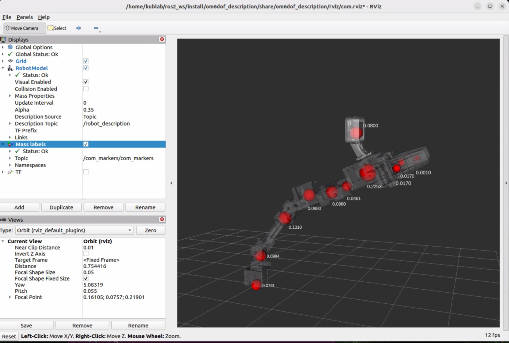

# om6dof_description

## License and provenance

See [LICENSE](LICENSE) for Apache-2.0 and [NOTICE](NOTICE) for ROBOTIS author
credits, exact upstream mesh matches, and modifications to the robot model.
Both files are installed into this package's share directory. The unchanged
ALOHA wrist bracket retains the [MIT license](meshes/LICENSE-ALOHA.txt),
Copyright (c) 2023 Tony Z. Zhao; this license is installed with the meshes.
Other additional
camera/bracket assets listed in NOTICE still require source/license
confirmation; they are not automatically covered by the upstream arm license.

URDF/Xacro, meshes, kinematic frames, joint limits, and inertial parameters for
the OM6DOF manipulator. This package is the common robot model for MoveIt,
`robot_state_publisher`, collision checking, and the KDL gravity model used by
the Mode 0 leader controller.

The `om6dof_v2` variant uses `chain_link3_v2.stl` for link3 visual and collision
geometry, while retaining the existing joint/link names. This v2 mesh is authored
in metres (unlike the original millimetre mesh), so the URDF applies unit scale
and an origin alignment. The named `link3_v2_*_offset` Xacro properties are
available for small mechanical fit adjustments. Its `joint3` origin is also
relocated to the v2 output mounting-hole centre (measured from its STL), so
link4 attaches to that hole rather than the original mesh's datum. Link4 is
mounted perpendicular to link3 with a +90-degree rotation about the joint3
axis. `joint4` retains link4's original horn datum; moving that joint would
move child link5 rather than repositioning the horn. A +1 mm X fitting offset
at `joint3` instead moves the complete link4 branch, including its horn and
downstream links. After rebuilding this package, open it with:

```bash
ros2 launch om6dof_description view_robot_v2.launch.py
ros2 launch om6dof_description view_com_v2.launch.py
```

The COM viewer retains link3's existing inertial values; they have not yet been
recalculated from the v2 mesh.

`om6dof_v2` displays the D435 wrist-camera assembly. Its legacy D405 TF names
are retained temporarily for compatibility with existing ROS consumers; do not
use them as calibrated D435 optical extrinsics. Its two bracket bolt axes
(16 mm spacing) align with the link7 hole pair at Y=+/-8 mm, Z=28 mm.
The bracket underside at the bolt axes is seated on link7's outer surface
(X=-37.80499 mm), using the underside triangles as the contact reference.
The underside has a small slope, so this aligns contact at the bolt axes.
These coordinates come from the STL. V2 uses its own
[payload_d435.yaml](config/payload_d435.yaml), leaving the original D405
configuration unchanged. The D435 nominal mass is **75 g** (manufacturer
tolerance +/-10%) from the [Intel March 2023 datasheet, Table 3-52](https://www.realsenseai.com/wp-content/uploads/2023/03/Intel-RealSense-D400-Series-Datasheet-March-2023.pdf#page=67).
With the measured **6.47 g bracket**, the modelled payload is **81.47 g**;
extra mounting screws and the USB cable are not included.

The camera CoM is estimated at the housing bounding-box centre; the bracket
CoM is its closed-mesh volume centroid assuming uniform density. Both are
stored in the original STL CAD frame (converted from mm to m), combined as
`(camera_mass * camera_com + bracket_mass * bracket_com) / total_mass`, and
translated by the same CAD datum as the visual. This puts the combined CoM
at approximately **[18.565, 16.150, -0.044] mm** in `d405_payload_link`,
without moving the accepted camera mounting pose. This is a geometric
estimate, not a measurement of the camera's internal mass distribution.
The inertia tensor remains a sphere approximation, not calibrated dynamics.

For the complete gravity-compensation architecture and the current validation
status, see [the leader-arm research record](../docs/leader_arm_gravity_compensation.md).



`ros2 launch om6dof_description view_com.launch.py` draws every link's centre
of mass with its mass in kg. Drag the joint sliders and the levers swing --
that is what `g(q)` is computing.

## Kinematic chain

The arm chain used by the leader controller is:

```text
world -> base_link (20 mm pedestal) -> link1 -> joint1 -> link2 -> joint2 -> link3
      -> joint3 -> link4 -> joint4 -> link5 -> joint5
      -> link6 -> joint6 -> link7 -> end_effector_link
```

The gripper fingers and D405 payload are branches from the wrist structure.
They are visible in the full URDF tree but are not automatically included in a
single serial `KDL::Tree::getChain()` result.

### Arm joint contract

| Joint | Axis | Lower limit | Upper limit | Velocity limit |
|---|---|---:|---:|---:|
| `joint1` | Z | -2.82743 rad | +2.82743 rad | 4.8 rad/s |
| `joint2` | Y | -2.04204 rad | +2.10487 rad | 4.8 rad/s |
| `joint3` | Y | -1.88496 rad | +2.13628 rad | 4.8 rad/s |
| `joint4` | Z | -2.82743 rad | +2.82743 rad | 4.8 rad/s |
| `joint5` | Y | -1.97920 rad | +2.10487 rad | 4.8 rad/s |
| `joint6` | Z | -2.82743 rad | +2.82743 rad | 4.8 rad/s |

The companion leader controller validates this exact joint order and applies a
separate soft-limit margin before the hard URDF limits.

## Dynamics and gravity-model notes

Each serial-chain link must have a positive mass and physically valid inertia.
The leader controller refuses to configure if required dynamics are missing or
the KDL joint order differs from `joint1..joint6`.

Existence and positivity do not prove that a model is physically accurate.
Before publication or calibrated torque control, record for every link:

- mass measurement method and uncertainty;
- centre-of-mass source and coordinate frame;
- inertia source (CAD, identification, or approximation);
- mesh scale and origin;
- payload contents and mounting pose;
- author, date, and Git commit.

Earlier gravity work found two model issues:

1. approximately 0.114 kg of gripper and D405 payload mass lived on branches
   outside the extracted serial KDL chain;
2. several link centres of mass were corrected after the first current-data fit.

Consequently, coefficients fitted against the pre-correction model are stale.
The historical plots are retained as diagnostics in
[`docs/assets/identification/legacy-20260820`](../docs/assets/identification/legacy-20260820/MANIFEST.md),
not as final validation.

## Meshes and images

The `meshes/` directory contains the main chain, gripper fingers, D405, and
wrist-mount STL geometry. These tracked CAD assets can be used to create a
neutral RViz/URDF render for documentation.

No verified physical OM6DOF photograph was found during the 2026-08-21 audit.
Do not use photographs of a Piper or phosphobot as a substitute. A future
physical photo should record author, date, and reuse permission; a future RViz
render should record the URDF commit and fixed camera pose.

## Expand and inspect

Normal profile:

```bash
source /opt/ros/humble/setup.bash
source ~/ros2_ws/install/setup.bash
xacro \
  ~/ros2_ws/src/om6dof/om6dof_bringup/urdf/om6dof.urdf.xacro \
  > /tmp/om6dof-normal.urdf
check_urdf /tmp/om6dof-normal.urdf
```

Leader profile:

```bash
xacro \
  ~/ros2_ws/src/om6dof_leader_controller/urdf/om6dof.leader.urdf.xacro \
  > /tmp/om6dof-leader.urdf
check_urdf /tmp/om6dof-leader.urdf
```

When reviewing an expanded file, verify exactly one intended `<ros2_control>`
block. A stale `robot_state_publisher` can publish a description without that
block and race the hardware owner at startup; use one publisher and one
controller manager per profile.

## Change-control checklist

Any change to mass, CoM, inertia, joint origin, axis, payload, or frame can alter
gravity compensation. After such a change:

1. expand and validate the URDF;
2. compare the KDL joint order;
3. regenerate gravity predictions at recorded poses;
4. invalidate old fitted current coefficients explicitly;
5. rerun supported low-gain gravity trials;
6. update the research document, dataset manifest, and model commit.
