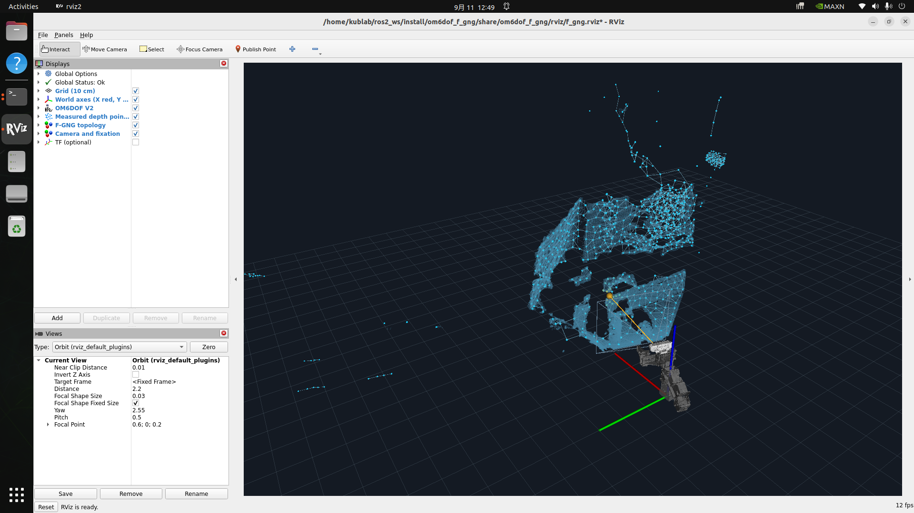

# om6dof_f_gng

Foveated Growing Neural Gas, DD-GNG, dan DBL-GNG untuk OM6DOF V2, dengan
visualisasi native RViz 2.
Depth RealSense dikonversi ke point cloud 3D, lalu ditransformasikan ke `world`
menggunakan TF **pada waktu pengambilan depth** sebelum membentuk topologi.
Memori voxel menyimpan observasi dunia agar peta dapat berkembang dari beberapa
sudut pandang kamera. Foviasi mengatur kepadatan pembelajaran berdasarkan arah
pandangan dan jarak fokus; fokus ini adalah fokus algoritma, bukan motor lensa.

Rancangan algoritma baru dan paper sekarang disimpan bersama package ini:

- [Rencana bio-inspired aktif](docs/design/BIO_INSPIRED_FOVEATION.md)
- [Rancangan V2 lama yang sudah digantikan](docs/design/FOVEATION_V2_DESIGN.md)
- [Paper WA-FGNG ICRA 2027](paper/icra2027_fgng/README.md)
- [PDF paper](paper/icra2027_fgng/main.pdf)

Angka pada paper berasal dari implementasi dan benchmark legacy yang direkam di
`TopoVLA`; perubahan ROS terbaru harus dievaluasi ulang sebelum dimasukkan ke
tabel atau klaim paper.



## Build dan jalankan

```bash
cd ~/ros2_ws
source /opt/ros/humble/setup.bash
colcon build --packages-select om6dof_f_gng --symlink-install
source install/setup.bash
ros2 launch om6dof_f_gng f_gng.launch.py
```

Launch membuka RealSense, menjalankan pemetaan F-GNG, dan menampilkan RViz.
Tutup RViz atau tekan `Ctrl+C` pada terminal untuk mengakhiri sesi sekaligus
melepaskan kamera. Package memerlukan ROS 2 Humble, RViz 2, NumPy, dan
`pyrealsense2` untuk sumber kamera langsung.

Jalankan saat `robot_state_publisher` dengan URDF `om6dof_v2` dan publisher
`/joint_states` robot sudah aktif. Launch ini memakai TF yang tersedia; tidak
menjalankan controller atau mengirim perintah gerak robot. Tutup RealSense Viewer
dan viewer F-GNG lama sebelum launch karena kamera hanya boleh dibuka oleh satu
pipeline SDK pada saat yang sama.

## Membandingkan DD-GNG dan DBL-GNG

Implementasi C++ native dari TopoVLA disalin ke package ini. Jalankan **satu
algoritma per sesi**, lalu tutup RViz atau hentikan launch sebelum menjalankan
algoritma berikutnya. Ketiga launch menggunakan kamera dan topic keluaran yang
sama, sehingga menjalankannya bersamaan akan mencampur graf dan berebut kamera.

```bash
source ~/ros2_ws/install/setup.bash

# F-GNG: perhatian berdasarkan arah pandangan dan jarak fokus
ros2 launch om6dof_f_gng f_gng.launch.py

# DD-GNG: graf oranye, tanpa foviasi
ros2 launch om6dof_f_gng dd_gng.launch.py

# DBL-GNG: graf ungu, tanpa foviasi
ros2 launch om6dof_f_gng dbl_gng.launch.py
```

Jalur data untuk ketiganya adalah **depth + intrinsik → point cloud 3D optik →
TF pada timestamp depth → titik 3D dalam `world` → pembelajaran graf → RViz**.
DD-GNG dan DBL-GNG menerima koordinat XYZ dalam meter; koordinat piksel gambar
tidak dijadikan koordinat simpul. Simpul mempertahankan koordinat dunia saat
kamera bergerak, sesuai pose yang diberikan TF. Tampilan baseline hanya
menampilkan frustum kamera dan tidak menyediakan alat Publish Point untuk fokus.

| Launch | Inti native asal di TopoVLA | Node ROS |
|---|---|---|
| `f_gng.launch.py` | `native_fgng_bio` | `/om6dof_f_gng/f_gng` |
| `dd_gng.launch.py` | `native_depth_yolo/src/ddgng.hpp`, dipakai oleh `native_ddgng` | `/om6dof_f_gng/dd_gng` |
| `dbl_gng.launch.py` | `native_dblgng/include/dblgng_core.hpp` | `/om6dof_f_gng/dbl_gng` |

Profil ketiganya menggunakan depth 0,15–3 m, 320×240 setelah subsampling,
maksimum 768 simpul, voxel 1 cm, kapasitas memori 16.000 titik, anggaran input
12.000 titik, dan anggaran replay 4.000 titik. Pada baseline, `memory_mode:=world`
menambahkan memori voxel dan replay di luar inti native agar observasi dari
beberapa pose kamera tetap digunakan. Mode `memory_mode:=current` memberikan
hanya titik frame saat ini ke algoritma; graf tetap berlanjut antar-frame.
Mode tersebut tidak menghapus atau memulai ulang graf setiap frame.

```bash
ros2 launch om6dof_f_gng dd_gng.launch.py memory_mode:=current
ros2 launch om6dof_f_gng dbl_gng.launch.py memory_mode:=current
```

**Default baseline menampilkan edge native tanpa filter dukungan permukaan**
(`edge_support_radius=0`). F-GNG memakai radius dukungan 5 cm. Karena itu,
jumlah edge default tidak dapat dibandingkan sebagai hasil filter yang setara.
Untuk memakai pemeriksaan dukungan permukaan yang sama pada DD-GNG dan DBL-GNG:

```bash
ros2 launch om6dof_f_gng dd_gng.launch.py \
  edge_support_radius:=0.05
ros2 launch om6dof_f_gng dbl_gng.launch.py \
  edge_support_radius:=0.05
```

Filter dukungan permukaan hanya memilih edge yang diekspor ke RViz; aturan
pembelajaran inti DD-GNG/DBL-GNG tetap berasal dari program native.

DD-GNG memakai `dd_updates:=500` per epoch frame, mengikuti jumlah pembaruan
default program `native_ddgng`; DBL-GNG memproses sampel replay per epoch sesuai
aturan intinya. Setelah graph pernah mencapai `max_nodes`, DBL-GNG mengakumulasi
strength dan menjalankan edge cutting setiap `edge_cut_period_frames` frame valid
(default 10). Pemotongan dilakukan setelah seluruh epoch frame tersebut selesai.
Menyamakan batas simpul dan sumber data tidak menjamin jumlah operasi atau waktu
komputasi yang sama. Untuk benchmark, gunakan rekaman depth, intrinsik, dan TF
yang sama serta laporkan waktu pembaruan dari topic status.
Percobaan live berurutan hanya membantu pemeriksaan visual, bukan bukti bahwa
salah satu algoritma lebih akurat.

Argumen `start_camera`, `depth_topic`, `camera_info_topic`, `camera_frame`,
`world_frame`, `use_rviz`, `camera_serial`, dan `params_file` berlaku juga pada
kedua launch baseline. Tambahan baseline adalah `max_nodes`, `memory_mode`,
`edge_support_radius`, `edge_cut_period_frames` khusus DBL-GNG, serta `dd_updates`
khusus DD-GNG.
Argumen tersebut mengesampingkan nilai yang sama dalam `params_file`.
Parameter lain tersedia di [`config/dd_gng.yaml`](config/dd_gng.yaml) dan
[`config/dbl_gng.yaml`](config/dbl_gng.yaml). Ubah profil lalu mulai sesi baru
untuk mengganti parameter pembelajaran. Layanan reset tetap sama untuk ketiganya:

```bash
ros2 service call /om6dof_f_gng/reset std_srvs/srv/Trigger '{}'
```

## Tampilan dan fokus

- **World axes**: X merah, Y hijau, Z biru. Frame robot mengikuti tangan kanan:
  +X maju, +Y kiri, +Z atas. Frame optik kamera memiliki +X kanan, +Y bawah,
  +Z depan; TF menghubungkan kedua konvensi tanpa membalik sumbu dunia.
- **Measured depth points**: titik pengukuran depth frame terbaru, berwarna
  sian redup. Nonaktifkan display ini untuk melihat graf lebih jelas.
- **F-GNG topology**: simpul dan edge peta yang terakumulasi. Simpul berubah dari
  sian ke emas menurut bobot perhatian. Edge dibatasi panjang dan dukungan
  pengukuran lokal agar tidak mudah menjembatani permukaan yang berjauhan.
- **Camera and fixation**: posisi/frustum kamera, arah pandangan, dan target fokus.
- Gunakan **Publish Point** pada toolbar RViz, lalu klik titik permukaan untuk
  menetapkan target fokus dalam `world`. Mode berpindah ke `world_lock`, sehingga
  arah pandangan mengikuti target tersebut saat kamera bergerak. Ini hanya
  mengubah perhatian algoritma; tidak menggerakkan robot atau kamera.

Kembali ke fokus otomatis pada arah pandangan saat ini:

```bash
ros2 param set /om6dof_f_gng/f_gng focus_mode auto
```

Atur jarak fokus manual, misalnya 0,8 m, atau pindahkan arah pandangan memakai
koordinat gambar ternormalisasi `gaze_u` dan `gaze_v` (0 sampai 1):

```bash
ros2 param set /om6dof_f_gng/f_gng focus_mode manual
ros2 param set /om6dof_f_gng/f_gng focus_distance 0.8
ros2 param set /om6dof_f_gng/f_gng gaze_u 0.5
ros2 param set /om6dof_f_gng/f_gng gaze_v 0.5
```

Hapus memori dan mulai membentuk peta baru:

```bash
ros2 service call /om6dof_f_gng/reset std_srvs/srv/Trigger '{}'
```

## Memakai depth dari ROS yang sudah aktif

`start_camera:=false` menghindari membuka SDK kamera kedua. Sesuaikan nama topic
dan frame optik dengan driver yang sedang dipakai:

```bash
ros2 launch om6dof_f_gng f_gng.launch.py \
  start_camera:=false \
  depth_topic:=/camera/camera/depth/image_rect_raw \
  camera_info_topic:=/camera/camera/depth/camera_info \
  camera_frame:=d435_depth_optical_frame
```

Input berupa depth terkalibrasi berformat `32FC1` dalam meter atau `16UC1` dalam
milimeter, dengan `CameraInfo` yang cocok: ukuran dan frame optik sama, timestamp
sama dengan depth (atau nol untuk intrinsik statis), matriks `K` sesuai gambar
yang dikirim, serta koefisien distorsi nol. Input dengan distorsi nonzero harus
direktifikasi dan kalibrasi yang dikirim harus mendeskripsikan gambar hasilnya.
Topic contoh di atas harus disesuaikan dengan sistem pengguna. Timestamp depth
harus sejalan dengan waktu TF robot.
Frame tanpa TF yang sesuai atau dengan pose/joint state basi dilewati dan
dilaporkan pada status; tidak diganti dengan pose identitas.

Launch arguments lain: `use_rviz:=false` untuk pemetaan tanpa GUI,
`camera_serial:=...` untuk memilih kamera, `world_frame:=...`, dan
`params_file:=/path/ke/f_gng.yaml` untuk profil parameter sendiri. Gunakan
`ros2 launch om6dof_f_gng f_gng.launch.py --show-args` untuk daftar lengkap.

## Topic dan parameter

| Topic | Tipe | Isi |
|---|---|---|
| `/om6dof_f_gng/depth/image_raw` | `sensor_msgs/Image` | Depth kamera langsung |
| `/om6dof_f_gng/depth/camera_info` | `sensor_msgs/CameraInfo` | Intrinsik yang sesuai resolusi depth |
| `/om6dof_f_gng/points` | `sensor_msgs/PointCloud2` | Pengukuran terbaru dalam frame dunia |
| `/om6dof_f_gng/graph` | `visualization_msgs/MarkerArray` | Simpul dan edge topologi dunia |
| `/om6dof_f_gng/focus` | `visualization_msgs/MarkerArray` | Frustum; F-GNG juga menerbitkan arah pandangan dan target fokus |
| `/om6dof_f_gng/status` | `diagnostic_msgs/DiagnosticArray` | Kualitas pembaruan, ukuran peta, dan alasan frame ditolak |
| `/clicked_point` | `geometry_msgs/PointStamped` | Target fokus dari RViz, khusus F-GNG |

Profil default di [`config/f_gng.yaml`](config/f_gng.yaml): depth 0,15–3 m,
640×480 pada 15 Hz sebelum subsampling stride 2 menjadi 320×240, maksimum 768
simpul, voxel 1 cm, memori 16.000 titik, edge maksimum 15 cm, serta radius
dukungan edge 5 cm. Frekuensi frame kamera bukan jaminan frekuensi pemetaan;
periksa topic status untuk kinerja aktual. Parameter fokus dapat diubah saat
berjalan. Ubah parameter struktural pada YAML, lalu jalankan ulang.

## Batas interpretasi

Peta bergantung pada TF kinematika robot dan extrinsik kamera. Mount D435 pada
URDF V2 saat ini memakai posisi nominal CAD; perubahan pose yang konsisten tetap
memerlukan kalibrasi hand–eye yang terukur agar akurasi geometrinya dapat dinilai.
`world` yang terikat pada base robot tidak menggantikan lokalisasi base bergerak.
Graf merupakan representasi permukaan dengan memori terbatas, bukan mesh penuh,
SLAM, atau sertifikat jalur bebas tabrakan. Belum ada penghapusan permukaan dinamis
berdasarkan bukti ruang kosong.

Inti F-GNG berasal dari `TopoVLA/native_fgng_bio` beserta komponen GNG/world
yang digunakan oleh implementasi tersebut. Inti DD-GNG dan DBL-GNG disalin dari
path yang tercantum pada tabel perbandingan di atas; asal dan checksum berkas
tersedia pada `CORE_PROVENANCE.json`, `BASELINE_PROVENANCE.json`, dan
`THIRD_PARTY_NOTICE.md`. Memori dunia,
konversi depth, dan integrasi ROS/RViz merupakan pembungkus untuk inti baseline;
hasil eksperimen paper tetap perlu dievaluasi secara terpisah dengan dataset
dan protokol yang sesuai.

## Verifikasi integrasi

Pengujian live D435I dengan TF robot menghasilkan 147 pesan graf dalam jendela
15 detik (termasuk startup), 768 simpul, dan edge terpanjang 0,1498 m. Update inti
mapper rata-rata 21,6 ms pada sesi tersebut. Ini pengukuran runtime, bukan hasil
benchmark akurasi; detail tersimpan di `docs/live_verification.json`.

```bash
cd ~/ros2_ws
colcon test --packages-select om6dof_f_gng
colcon test-result --test-result-base build/om6dof_f_gng --verbose
```

Tes mencakup perilaku fokus dan memori graf, adapter RealSense, serta jalur ROS
dengan TF sintetis yang diketahui: tangan kanan, timestamp, padding/endian,
dua encoding depth, depth kosong, target Publish Point, penolakan frame basi,
dan reset. Uji ROS memakai domain DDS terisolasi dan tidak membutuhkan kamera.

Kedua launch baseline juga sudah diuji dengan RealSense D435I dan TF robot.
Dalam sesi terpisah sepanjang 18 detik, DD-GNG menerbitkan 184 pesan graf dan
DBL-GNG 196 pesan graf; keduanya mencapai 768 simpul. Filter edge tambahan
dinonaktifkan, sehingga jumlah edge keluaran sama dengan edge native.
Sesi tersebut memakai pengamatan pada waktu berbeda dan jumlah operasi
pembelajaran berbeda; angka ini memverifikasi fungsi, bukan peringkat algoritma.

| Baseline | Hasil RViz |
|---|---|
| DD-GNG | [Screenshot oranye](docs/ddgng_rviz.png) |
| DBL-GNG | [Screenshot ungu](docs/dblgng_rviz.png) |

Detail pengujian tersimpan di `docs/baselines_verification.json` dan
`docs/baselines_tests.log`. Tes pembungkus membandingkan posisi simpul dan edge
dengan panggilan langsung ke core asli pada input dunia yang sama, serta
memastikan hasil F-GNG tetap sama setelah penambahan pilihan algoritma.
