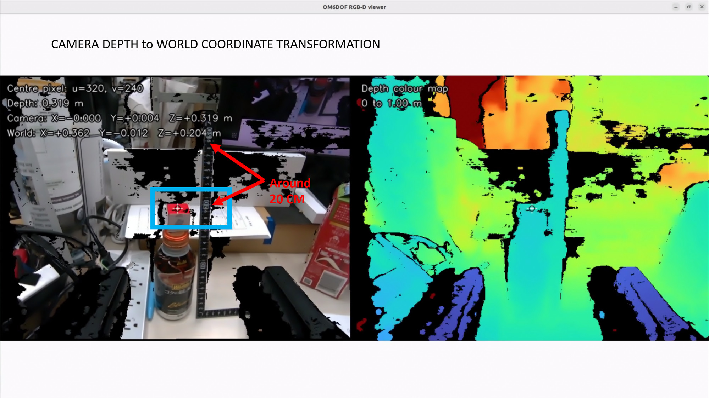

# om6dof_perception

> **Leader-profile note:** perception itself does not own U2D2, but any action
> that invokes MoveIt/pickup requires the normal position-control profile. Do not
> command pickup while the isolated Mode 0 leader stack is active. See the
> [leader-arm gravity-compensation record](../docs/leader_arm_gravity_compensation.md).

RealSense RGB-D perception for the OM6DOF arm. Local YOLOX-S detects a COCO
target class, OpenCV CSRT tracks it between detections, and aligned depth
produces its 3D position in the selected camera's optical frame. Ollama and a
VLM are not used by this node. V1 uses D405; the explicit V2 profile uses D435
and the updated V2 arm/camera geometry for its optional coordinate preview.



The screenshot records an earlier coordinate-debug view; the live perception
overlay itself displays camera-space observations, not a calibrated world pose.

## V2 / D435

Build the updated description, perception, and legacy-picker input guard:

```bash
cd ~/ros2_ws
source /opt/ros/humble/setup.bash
colcon build --symlink-install --packages-select \
  om6dof_description om6dof_perception om6dof_pick_and_place
source install/setup.bash
ros2 launch om6dof_perception perception_v2.launch.py
```

Stop other camera-owning applications first. This launch starts **perception
and a read-only coordinate projector only**: no hardware controller, MoveIt,
pickup action, or robot motion. It requires the YOLOX model described below.
Existing services and the generic `perception.launch.py` still default to V1;
do not run a V1 service and the V2 launch simultaneously.

If several D435 units are connected, select the wrist unit explicitly:

```bash
ros2 launch om6dof_perception perception_v2.launch.py camera_serial:=YOUR_SERIAL
```

The serial is treated as a string (including leading zeroes). Only the chosen
model is opened; multiple matching devices require a serial. Reconnection
stays on the same unit and discards old images, tracking results and points.
D435i is supported by explicit selection:

```bash
ros2 launch om6dof_perception perception_v2.launch.py camera_model:=D435i
```

The [official D435i description](https://github.com/realsenseai/realsense-ros/blob/ros2-development/realsense2_description/urdf/_d435i.urdf.xacro)
reuses D435 RGB/depth geometry and adds IMU frames. This perception node uses
RGB/depth only, retains `d435_color_optical_frame`, and reports the actual
selected model as `D435i` in status. Live sensor calibration still comes from
the connected unit; arm extrinsics remain nominal. This option does not change
the existing payload mass estimate or enable IMU streaming.
D435i/D435f are not silently substituted for D435. Camera/model parameters are
startup-only: restart the node to change them.

| Output | V1 | V2 |
|---|---|---|
| `target_point` / `ee_point` frame | `camera_color_optical_frame` | `d435_color_optical_frame` |
| Default EE mode | Legacy fixed jaw pixels | Disabled; D405 pixels are invalid for this mount |
| Optional `target_point_world` | Not provided here; existing picker handles V1 | `base_link`, using **V2** URDF FK and camera frames |
| Camera-to-arm transform | External legacy picker calibration | CAD/nominal mounting, **not hand-eye calibrated** |

For V2 the SDK supplies native depth vertices, depth scale, color intrinsics,
distortion and the device-calibrated depth-to-color transform. The vertices are
transformed into the color optical frame and matched to color pixels with a
nearest-depth buffer. Missing/occluded depth remains invalid, rather than
being filled with fabricated coordinates. This follows the
[RealSense projection and extrinsics conventions](https://dev.realsenseai.com/docs/projection-in-realsense-sdk-2-0/).
Low-light mode chooses a common FPS advertised by the actual color and depth
profiles; it does not reuse a hardcoded D405 frame rate. Normal D435 mode
retains the device's emitter setting instead of forcibly disabling it.

The coordinate projector reads `om6dof_v2.urdf.xacro` from the installed
`om6dof_description`, including its changed joint origins/axes and
[D435 camera-frame configuration](../om6dof_description/config/camera_d435.yaml).
It does not reuse the controller/picker's V1 FK, consume an ambiguous existing
TF tree, or broadcast competing TF. Mounting geometry and CoM are unchanged.

`/om6dof_perception/target_point_world` is an **estimated base-frame observation**,
not a ready-to-execute grasp command. It requires a complete `/joint_states`
sample within 50 ms of the point's ROS host-receipt timestamp; both must be
no older than 0.5 s. Missing, non-finite, future, stale, or wrong-frame data is
rejected. There is no fallback to the latest joint positions. All publishers
must use the same ROS domain and clock. Host receipt is **not** synchronized
camera exposure/encoder timing; moving-arm precision still needs validation.

```bash
ros2 topic echo --once /om6dof_perception/target_point
ros2 topic echo --once /om6dof_perception/projection_status
ros2 topic echo --once /om6dof_perception/target_point_world
```

No joint feedback? Camera-space detection still works; the world topic stays
silent and `projection_status` explains why. For camera-only operation:

```bash
ros2 launch om6dof_perception perception_v2.launch.py publish_world_point:=false
```

Status JSON includes `model_version`, `camera_model`, `camera_frame`, connection
state, and live SDK geometry. Projection status separately reports the URDF
hash, matching timestamps, `transform_source: urdf_nominal`, and
`calibration_verified: false`. The web monitor continues to read the same
image/status topics; the image overlay identifies the selected model.

**Near-field limitation:** D435 cannot measure as close as D405. At 640×480,
the manufacturer's nominal minimum depth is 175 mm; the current V2 TCP is
approximately 59 mm ahead of the depth sensor. The gripper jaws, and even a
target 80 mm ahead of the TCP, can therefore lie in its blind range. New jaw
pixel calibration cannot recover unavailable depth. Keep EE mode disabled
unless its geometry and measurable depth have been verified. See the
[D400 datasheet, Table 4-11](https://www.realsenseai.com/wp-content/uploads/2023/03/Intel-RealSense-D400-Series-Datasheet-March-2023.pdf#page=85).

If usable jaw pixels have actually been measured, explicitly opt in with
`ee_mode:=fixed_jaw_pixels ee_pixels_calibrated:=true` and provide the new
`ee_left_pixel` / `ee_right_pixel`; the old D405 values are not a V2 calibration.

The direct picker now accepts only the matching V2 metadata and
`d435_color_optical_frame` for perception-driven motion. D405/V1 observations
are rejected, cached targets are cleared, and active perception work is
cancelled through the existing cancellation path. Its D435 transform is the
CAD/nominal V2 URDF transform; complete hand-eye calibration and near-field
validation are still required before relying on it for precise physical picks.

The V2 launch uses a 0.5 s YOLO refresh, a 15 Hz tracking loop, and a 480 px
browser preview. YOLOX-S runs through CPU-only OpenCV on this host, so CSRT
tracks between full detections. Override `reacquire_period_sec`,
`frame_rate_hz`, or `web_stream_max_width` on the launch command when tuning;
shortening the refresh below one inference time cannot increase throughput.

## Run

Download the Apache-2.0 OpenCV Zoo YOLOX-S ONNX model once on the AGX:

```bash
mkdir -p ~/.cache/om6dof_perception
curl -L --fail \
  -o ~/.cache/om6dof_perception/yolox_s.onnx \
  https://github.com/opencv/opencv_zoo/raw/main/models/object_detection_yolox/object_detection_yolox_2022nov.onnx
echo "c5c2d13e59ae883e6af3b45daea64af4833a4951c92d116ec270d9ddbe998063  $HOME/.cache/om6dof_perception/yolox_s.onnx" \
  | sha256sum -c -
ros2 launch om6dof_perception perception.launch.py
```

Open the application web monitor at `http://<robot-ip>:8080`. The processed
RealSense perception card appears automatically because perception publishes
its JPEG overlay to
`/application_web_monitor/perception/image/compressed`. It disappears shortly
after perception stops. The Go2W built-in camera remains available separately
on `/application_web_monitor/image/compressed`.

## Sharing the camera with DD-GNG

Perception and DD-GNG both own the same RealSense, so only one may run.
The service definitions use the V2/D435i contract and the responsive defaults
above. Do not run another camera-owning process at the same time.

```bash
# perception
systemctl --user stop om6dof-dd-gng.service
systemctl --user start om6dof-perception.service om6dof-perception-pick.service

# DD-GNG
systemctl --user stop om6dof-perception.service om6dof-perception-pick.service
systemctl --user start om6dof-dd-gng.service
```

Each mode publishes its own JPEG topic, so the dashboard shows whichever is up:

| Mode | Topic |
|---|---|
| Perception | `/application_web_monitor/perception/image/compressed` |
| DD-GNG | `/application_web_monitor/ddgng/image/compressed` |

No camera in the dashboard? Check the service first, then the topic:

```bash
systemctl --user status om6dof-perception.service --no-pager
journalctl _SYSTEMD_USER_UNIT=om6dof-perception.service -n 100 --no-pager
ros2 topic info -v /application_web_monitor/perception/image/compressed
lsusb | grep -i realsense
```

Publisher count must be at least one.

## Control from the Kublab GUI

Install the perception user service locally on the AGX. This does not require
SSH or a connection to the Jetson NX:

```bash
mkdir -p ~/.config/systemd/user
install -m 0644 \
  ~/ros2_ws/install/om6dof_perception/share/om6dof_perception/systemd/om6dof-perception-user.service \
  ~/.config/systemd/user/om6dof-perception.service
systemctl --user daemon-reload
```

The **OM6DOF perception** card can now start and stop the local AGX user
service. It also publishes a new
target description on `/om6dof_perception/set_target`. Do not enable this unit
at boot when another application normally owns the RealSense camera. User
lingering should be enabled (`loginctl show-user kublab -p Linger`) if the
service must remain available without an interactive login.

Select another target at launch:

```bash
ros2 launch om6dof_perception perception.launch.py \
  target_description:="red cup on the table" target_class:=cup
```

Or change it while the node is running:

```bash
ros2 topic pub --once /om6dof_perception/set_target std_msgs/msg/String \
  "{data: 'red cup on the table'}"
```

Main outputs:

- `/om6dof_perception/target_point`
- `/om6dof_perception/target_bbox3d` (`[center_x, center_y, center_z, size_x, size_y, size_z]`)
- `/om6dof_perception/ee_point`
- `/om6dof_perception/relative` (`[dx, dy, dz, distance]`)
- `/om6dof_perception/distance` (`std_msgs/Float64`, meter)
- `/om6dof_perception/status`
- `/om6dof_perception/debug_image/compressed`
- `/application_web_monitor/perception/image/compressed`

`target_point` is the estimated object-volume centre, not merely the first
visible depth surface. The node isolates the foreground depth cluster inside
the YOLO box, measures its visible width/height, and infers the unseen depth
from the smaller visible extent. The inferred 3D dimensions are included in
the status JSON and drawn on the web overlay. Tune `bbox3d_depth_ratio` for an
object family whose depth differs substantially from its visible width.

The bundled model uses the 80 COCO classes. Free-form GUI text is reduced to a
known class (`red cup` -> `cup`, `glass jar` -> `bottle`). Because a robot
gripper is not a COCO class, EoE is estimated from two calibrated jaw pixels in
the **V1/D405** fixed camera view: left `(200, 430)` and right `(540, 400)`. Their aligned
depth points are averaged in 3D. Override them with `ee_left_pixel` and
`ee_right_pixel` after the camera mount or image crop changes.

The node opens the RealSense directly. Stop other camera-owning applications
before starting it.

## Pickup from perception

This section describes the **V1/D405 backend only**, not automatic V2 pickup.

The perception-driven pickup backend consumes
`/om6dof_perception/target_point`, rejects noisy depth clusters, transforms the
stable optical point through the calibrated wrist-camera extrinsic, and checks
both standoff and grasp poses with IK before allowing motion.

Install and start its user service locally on the AGX:

```bash
install -m 0644 \
  ~/ros2_ws/install/om6dof_pick_and_place/share/om6dof_pick_and_place/systemd/om6dof-perception-pick-user.service \
  ~/.config/systemd/user/om6dof-perception-pick.service
systemctl --user daemon-reload
systemctl --user start om6dof-perception-pick.service
```

Run only after confirming F3 remote mode is OFF and the arm workspace is clear:

```bash
ros2 service call /direct_reachable std_srvs/srv/Trigger '{}'
ros2 service call /run_perception_pick std_srvs/srv/Trigger '{}'
```

Sequence: initial pan/tilt lock -> ready/open -> direct 3D approach at
16/12/8 cm fingertip standoffs -> pan/tilt re-lock after every movement ->
short direct advance -> gripper close -> retreat/lift -> place -> release ->
ready. The approach follows the live EoE-to-object XYZ ray and is not forced
to stay horizontal.

If only the lower world-Z safety bound is violated, the backend can switch to
an upper-surface pick instead of rejecting the low object centre. It transforms
the complete YOLO 3D bounding box into the arm world frame, selects its upper
surface, validates a hover/pregrasp/grasp IK chain, then descends vertically.
X/Y safety bounds and the configured minimum EoE height still apply. See
[`om6dof_pick_and_place/README.md`](../om6dof_pick_and_place/README.md#automatic-upper-surfacetop-pick-fallback)
for the full state machine and tuning parameters.

The Kublab dashboard exposes the guarded action as **Pickup object**. It also
provides **Start searching state**: joint1 sweeps centre/left/right at low,
medium, and high joint5 views. Detection is accepted only after 10 consecutive
frames; any lost frame resets the counter.

## Offline regression checks

From the repository root, with ROS Humble sourced:

```bash
PYTHONPATH="$PWD/om6dof_perception:$PYTHONPATH" \
  python3 -m pytest om6dof_perception/test -q
python3 -m unittest discover -s om6dof_description/scripts -p test_d435_frames.py -v
```

These checks do not open a camera or command a robot. They cover model/serial
selection, D435 registered XYZ, nominal URDF camera frames, V2 FK, and stale or
incompatible inputs. Hardware calibration and dynamic accuracy remain separate
physical validation tasks.
